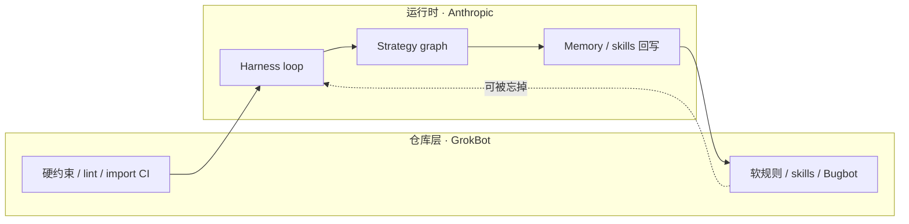
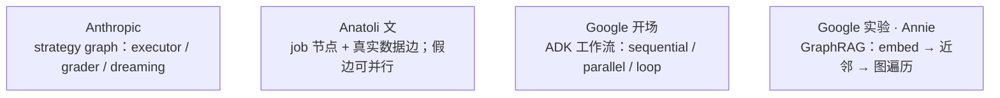

# 对着看

Anthropic 和 GrokBot 仍是一条链：一层把 **loop 跑稳**，一层把 **仓库喂到能放手**。Google 这场和 Anatoli 的文章共用「graph」这个词，但不是同一层东西，不要硬接成三部曲。

## Anthropic × GrokBot（runtime × repo）

一场讲 **runtime**（Anthropic：loop 怎么转、graph 怎么接），一场讲 **repo**（Lauren Tan：约束和 CI 怎么让你几乎不用看代码）。单独听都像方法论，对着看是一条链。

1. 没有硬约束，loop 跑得越久，仓库越脏（Lauren：只靠 soft rules，迟早变垃圾）。
2. 没有 durable brain + sandbox，loop 跑不长（Anthropic：沙箱挂了 agent 不该死）。
3. Memory / dreaming 写回去的东西，要落成 CI 或 skill，否则下一轮再忘。

| | Anthropic | GrokBot workshop |
| --- | --- | --- |
| 单位 | 一次会话里的 loop / 多 agent 互相反馈 | 一次 PR、一条 CI、一个 named agent |
| 怕的事 | 基础设施拖死长时任务 | 人肉 code review 当唯一护栏 |
| 放手的条件 | 恢复、沙箱、凭证注入都在 loop 外 | 最短路径 = 正确路径，编译过就能信 |

## Graph 这个词：三处不是同一层

[Google ADK / GraphRAG 实验](videos/google-graph-engineering.md) 的开场（PR **fan-out → join → router**）和 [Anatoli 文章](../Article/2026/2026-07-24-anatoli-graph-engineering.md) 的 **diamond** 形状相近：已知流程，扇出再汇合。证据只到这里。Annie 后半场的 GraphRAG 是 **Spanner 里的实体图 + 检索**，不是 job 网络；Anthropic 的 graph 是 **strategy / 多个 loop 互相反馈**。三套材料不要画成一条产品流水线。

| | Anthropic | Anatoli 文 | Google 实验 |
| --- | --- | --- | --- |
| 单位 | strategy graph；loop 互相反馈 | node = 有合约的 job；edge = 真数据依赖 | 开场：工作流图；实验：Spanner 实体图 |
| 和另外两份的重叠 | harness 是 loop | diamond / fake-edge / 新鲜上下文的 checker | 开场 PR fan-out→join→router（形状像 diamond） |
| 不要写进 Google 讲者 | dreaming ≠ 图自己改拓扑 | 「24/7 / graphs that improve themselves」是推文口号 | **52:21 口播是 runner + FastAPI 接线**，不是自我改图 |

Anatoli 是推广者，不是片子里的说话人。文章里的 fake-edge test、checker 不共享上下文、anchors，口播没有讲；实验室讲的是 ADK 原语和 GraphRAG 工具链。
