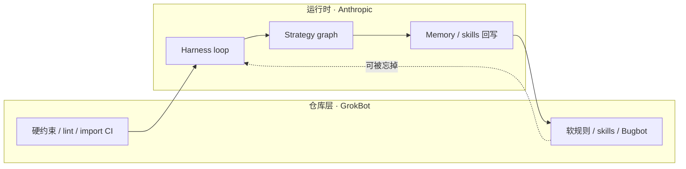

# 两场视频怎么叠在一起

一场讲 **runtime**（Anthropic：loop 怎么转、graph 怎么接），一场讲 **repo**（Lauren Tan：约束和 CI 怎么让你几乎不用看代码）。单独听都像方法论，对着看是一条链。

1. 没有硬约束，loop 跑得越久，仓库越脏（Lauren：只靠 soft rules，迟早变垃圾）。
2. 没有 durable brain + sandbox，loop 跑不长（Anthropic：沙箱挂了 agent 不该死）。
3. Memory / dreaming 写回去的东西，要落成 CI 或 skill，否则下一轮再忘。

| | Anthropic | GrokBot workshop |
| --- | --- | --- |
| 单位 | 一次会话里的 loop / 多 agent 互相反馈 | 一次 PR、一条 CI、一个 named agent |
| 怕的事 | 基础设施拖死长时任务 | 人肉 code review 当唯一护栏 |
| 放手的条件 | 恢复、沙箱、凭证注入都在 loop 外 | 最短路径 = 正确路径，编译过就能信 |
