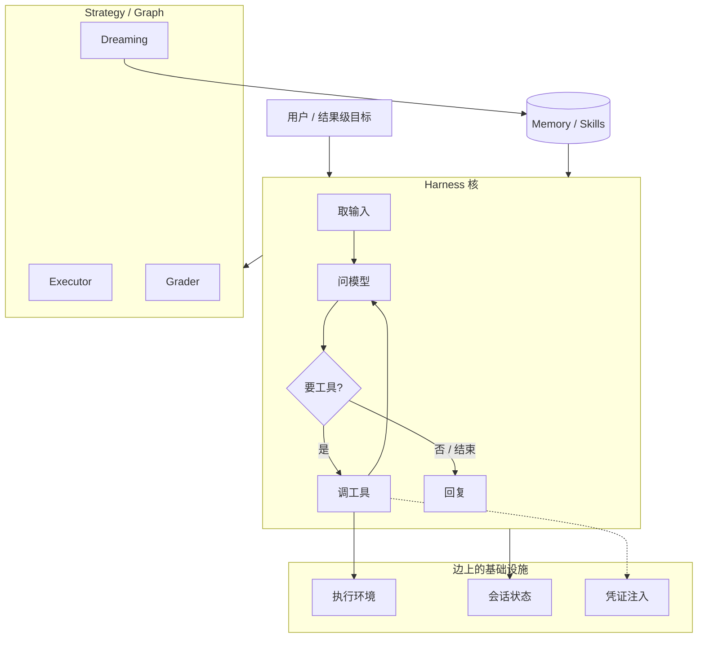
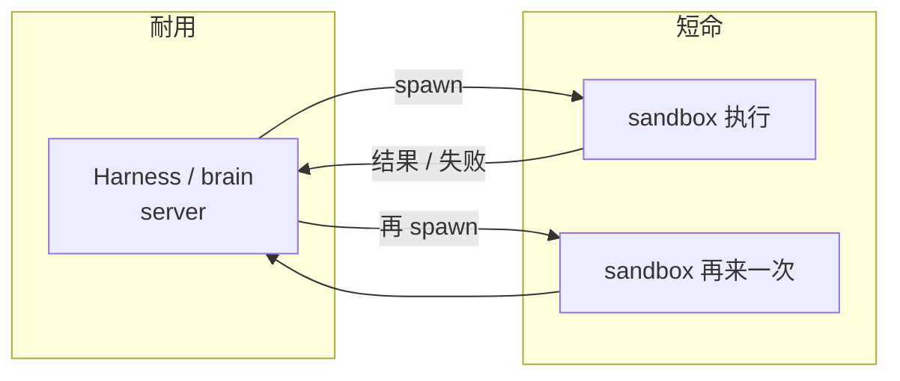
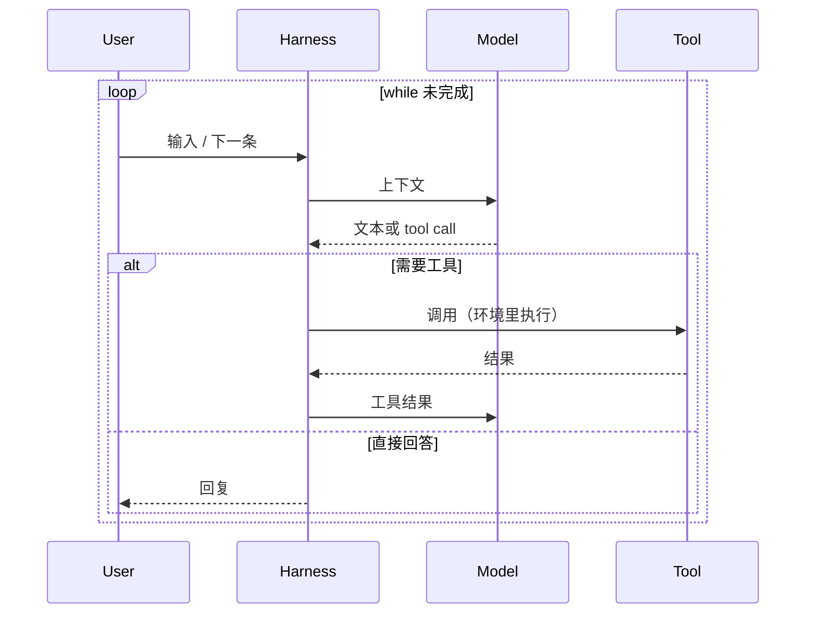
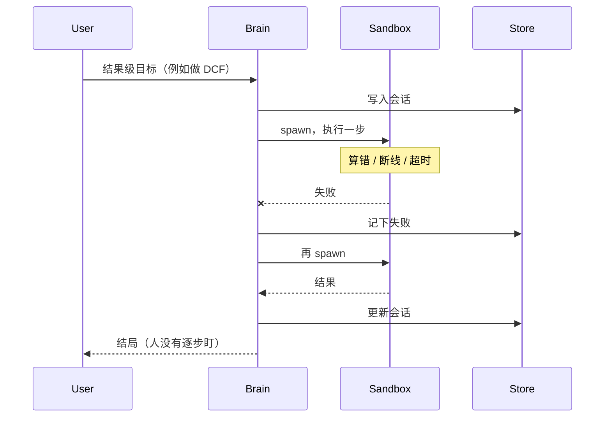
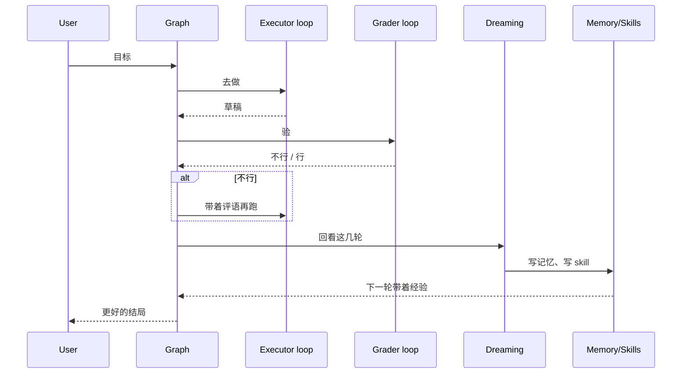

# Anthropic：Loops、Graphs、会自我改进的系统

- 视频：[x.com/Mahaximus_/status/2092670041062035853](https://x.com/Mahaximus_/status/2092670041062035853)（2026-08-26，41:30）
- 原文：[transcript](../../AI/2026/2026-08-26-anthropic-loops-graphs-transcript.md) · [短摘](../../AI/2026/2026-08-26-anthropic-loops-graphs.summary.md)
- 说话人：Anthropic 平台组。片子从对话中段切进来。

## 他们在反什么

旧习惯是「把模型指到正确方向」：任务切得很细（改 Excel 某几个格子），外面再包一层 scaffold。模型变强之后，卡点换了——它已经会自己往前走，缺的是 **跑得更久、出错能恢复、并且安全合规**。任务粒度也升了一档：不是改格子，是「给这家公司做 DCF，决定值不值得投」。

平台组的立场：长时运行、沙箱、会话恢复、凭证注入，是 **无差异化的基础设施**。你们该创新的是最靠近客户的那一层（怎么编排、给 token 什么工作），不要再手写一遍 while loop。

他们 **不相信** 存在「一个 harness 打天下」。经验上，不同问题要不同层的优化。

## 概念分层

| 层 | 他们的词 | 一句话 |
| --- | --- | --- |
| 核 | harness / loop | `while True: 用户 → 模型 → 工具` |
| 边 | environment / state / credentials | 安全执行、可暂停、MCP secret 不进上下文 |
| 上 | strategy / meta-harness / graph | 给 token 不同工作，loop 互相反馈 |
| 回写 | dreaming / memory / skills | 回看旧 session，写成记忆和 skill |

「Harness」被用滥了，几乎可以指整个应用。他们强调：只有中间那一小段「反复打模型」的代码才是核。

## 架构

### 框图：长时 agent 为什么拆成 brain + sandbox

沙箱技术默认是短命的。把「脑子」和「动手」绑在同一个 ephemeral 容器里，断线就整死。他们的拆法：

沙箱挂了，brain 还在，loop 可以再开一轮。这是「恢复」的物理含义。

## 时序

### 最小 harness（他们说的笑话版）

### 长任务 + 恢复

### Graph：Executor + Grader + Dreaming

「给 token 不同工作，而不是同一份 token 蛮力执行。」Grader 和 Executor 对着干，会到更好的结局；Dreaming 回看过去的 session，写 memory、写 skill。

多个 agent 时：各自一个 loop，**可以进对方的 loop**（他们说的 feedback into each other's loops）。那就是 graph，不是更大的 while。

## 他们自己怎么用

- 远程 agent 做完就说 *remember / save to memory*，看它写进去。错了再说 *that was wrong, don't do it again*。
- 用 agent 去用自己的产品（注册、截图、体验客户路径），dogfood 从「先写集成代码」变成「让 Claude 去点」。
- 一句话：少点按钮，多让模型把经验写回去。

## 时间锚

| 时间 | 点 |
| --- | --- |
| 00:00 | 片子中段切进：问题已变成恢复 / 安全 / 合规 |
| 00:47 | DCF 那种结果级任务 |
| 08:27 | 从 harness 优化变成 infrastructure |
| 10:15 | brain 耐久 + sandbox 短命 |
| 20:29 | dreaming：回看 session，写 memory / skills |
| 21:16 | “a harness is a loop” |
| 22:49 | meta-harness / strategy |
| 39:25 | remember, save to memory |

## 读原文时注意

Whisper 转写。专有名词偶发漂移。架构判断以 21:16–23:25 和 10:09–10:48 两段为准。
