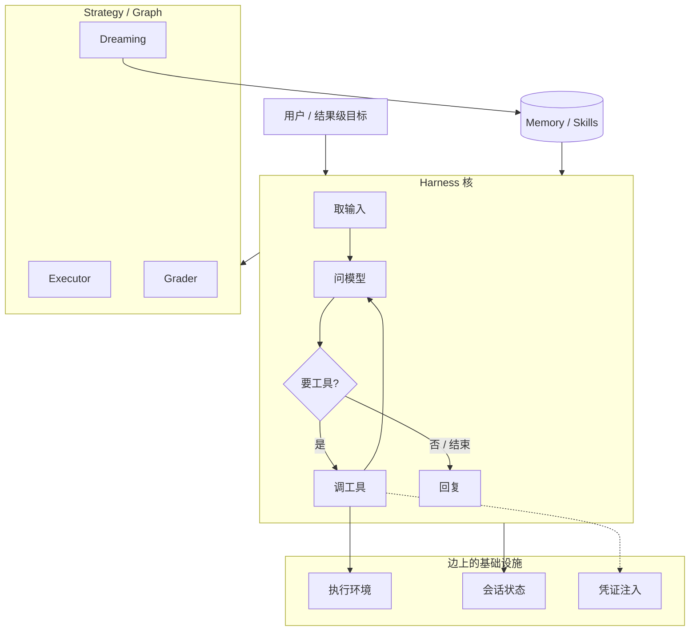
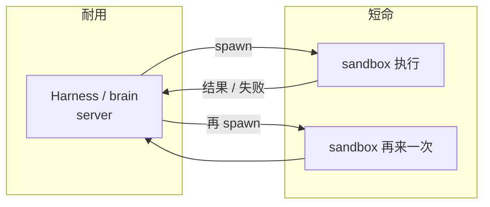
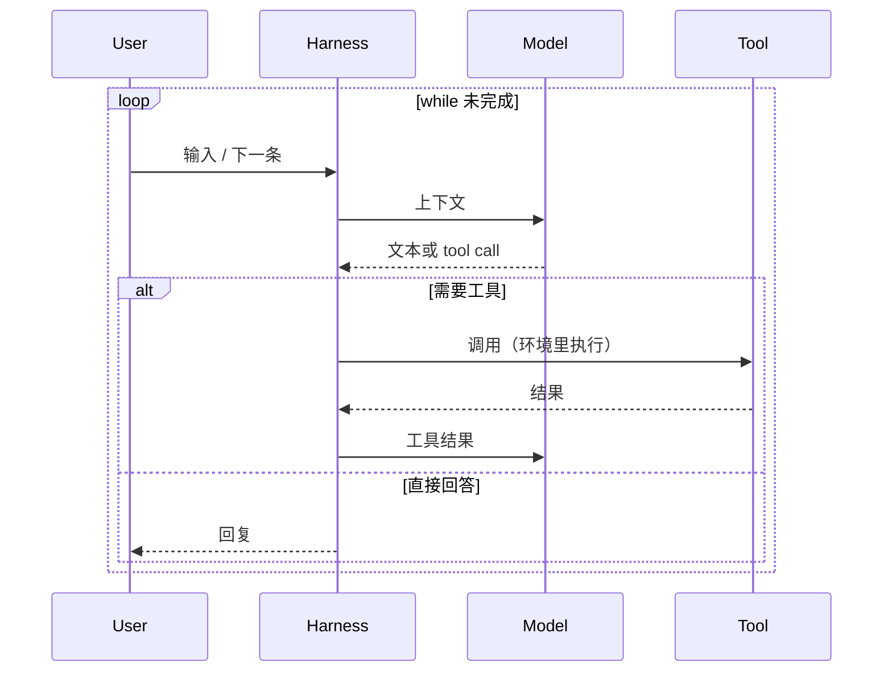
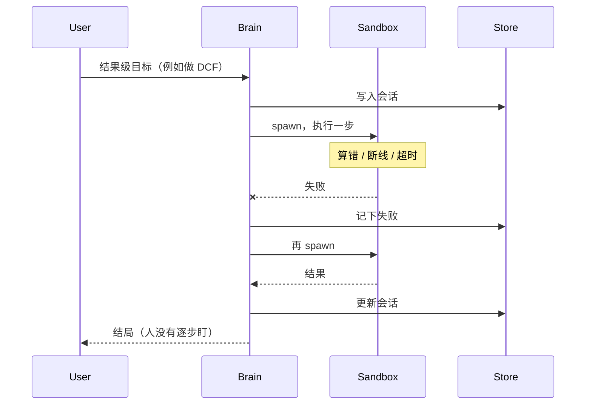
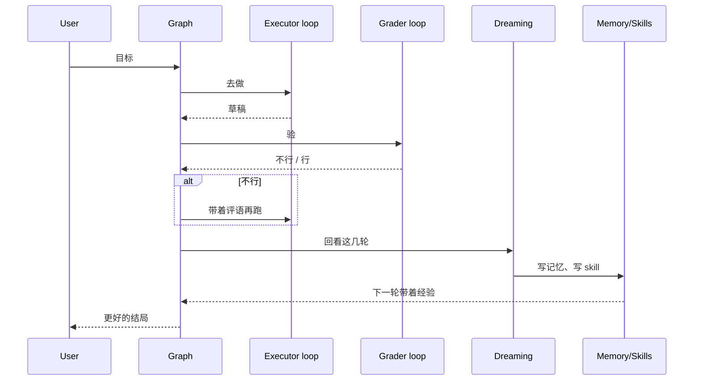

# Anthropic：Loops、Graphs、会自我改进的系统

- 视频：[x.com/Mahaximus_/status/2092670041062035853](https://x.com/Mahaximus_/status/2092670041062035853)（2026-08-26，41:30）
- 原文：[transcript](../../AI/2026/2026-08-26-anthropic-loops-graphs-transcript.md) · [短摘](../../AI/2026/2026-08-26-anthropic-loops-graphs.summary.md)
- 说话人：Anthropic 平台组。片子从对话中段切进来。

## 他们在反什么

旧习惯是「把模型指到正确方向」：任务切得很细（改 Excel 某几个格子），外面再包一层 scaffold。模型变强之后，卡点换了——它已经会自己往前走，缺的是 **跑得更久、出错能恢复、并且安全合规**。任务粒度也升了一档：不是改格子，是「给这家公司做 DCF，决定值不值得投」。

平台组的立场：长时运行、沙箱、会话恢复、凭证注入，是 **无差异化的基础设施**。你们该创新的是最靠近客户的那一层（怎么编排、给 token 什么工作），不要再手写一遍 while loop。

他们 **不相信** 存在「一个 harness 打天下」。经验上，不同问题要不同层的优化。

## 概念分层

| 层 | 他们的词 | 一句话 |
| --- | --- | --- |
| 核 | harness / loop | `while True: 用户 → 模型 → 工具` |
| 边 | environment / state / credentials | 安全执行、可暂停、MCP secret 不进上下文 |
| 上 | strategy / meta-harness / graph | 给 token 不同工作，loop 互相反馈 |
| 回写 | dreaming / memory / skills | 回看旧 session，写成记忆和 skill |

「Harness」被用滥了，几乎可以指整个应用。他们强调：只有中间那一小段「反复打模型」的代码才是核。

## 架构

### 框图：长时 agent 为什么拆成 brain + sandbox

沙箱技术默认是短命的。把「脑子」和「动手」绑在同一个 ephemeral 容器里，断线就整死。他们的拆法：

沙箱挂了，brain 还在，loop 可以再开一轮。这是「恢复」的物理含义。

## 时序

### 最小 harness（他们说的笑话版）

### 长任务 + 恢复

### Graph：Executor + Grader + Dreaming

「给 token 不同工作，而不是同一份 token 蛮力执行。」Grader 和 Executor 对着干，会到更好的结局；Dreaming 回看过去的 session，写 memory、写 skill。

多个 agent 时：各自一个 loop，**可以进对方的 loop**（他们说的 feedback into each other's loops）。那就是 graph，不是更大的 while。

## 他们自己怎么用

- 远程 agent 做完就说 *remember / save to memory*，看它写进去。错了再说 *that was wrong, don't do it again*。
- 用 agent 去用自己的产品（注册、截图、体验客户路径），dogfood 从「先写集成代码」变成「让 Claude 去点」。
- 一句话：少点按钮，多让模型把经验写回去。

## 时间锚

| 时间 | 点 |
| --- | --- |
| 00:00 | 片子中段切进：问题已变成恢复 / 安全 / 合规 |
| 00:47 | DCF 那种结果级任务 |
| 08:27 | 从 harness 优化变成 infrastructure |
| 10:15 | brain 耐久 + sandbox 短命 |
| 20:29 | dreaming：回看 session，写 memory / skills |
| 21:16 | “a harness is a loop” |
| 22:49 | meta-harness / strategy |
| 39:25 | remember, save to memory |

## 读原文时注意

Whisper 转写。专有名词偶发漂移。架构判断以 21:16–23:25 和 10:09–10:48 两段为准。

## 全文原文

按内容分段；每段前是该段起始时间戳。全文保留，不删减。

ASR 原文（Whisper 行级时间戳）仍以 [transcript](../../AI/2026/2026-08-26-anthropic-loops-graphs-transcript.md) 为准；Tweet/metadata 不收录。

### [00:00] 片子中段切进：恢复 / 安全 / 合规

You need a lot of infrastructure, you need a lot of ways to continue it to allow the agent to basically recover from its errors. And then to do work in ways that are secure and compliant with what you're trying to get it to do. And those are just a different class of problems.

So instead of spending all this effort to tell the model to go one direction, you're actually just like the model's doing it, just enable it to continue to run longer, execute, and recover from its errors.

Really cool.

### [00:24] 结果级任务（DCF）

And maybe before we dive into exactly how that works, do you have some examples of how these agents are, these long running agents are maybe more relevant to different use cases that wasn't possible to serve without this type of intelligence and infrastructure? It's actually just happening across the board almost through all of knowledge work.

And I think it looks a little invisible in a sense, but there's a lot of tasks where you give something, let's say in finance, where you want it to go and in the past you might have given a very, very concrete task. There is this Excel spreadsheet and you should calculate here and here it's very discrete and small. And that's kind of in the direction of you point the model at a thing and then you try to scaffold it around it.

So it specifically edits the cells that you wanted to go and edit. And today, you should be in a direction where you're just saying oh, so the whole thing I actually wanted to do is I actually just own a DCF of that company and decide if I should invest it or not at the right price. And that's the level in which you're talking about it.

And in that world, these kind of long running agents end up doing all the work. So they actually open the spreadsheet. They calculated for you. They then verify and say oops, I definitely did not calculate that right.

So let me try and do it again. But you didn't need to like interfere. You didn't need to hop in there and be like, make sure you double check your work or any of those kinds of things.

And so across like finance, I think across healthcare, across any kind of like knowledge work where you're just giving it sort of like an outcome, very much like you would a fellow associate. That is starting to become a place where work is just getting offloaded directly to agents and people are becoming more productive through those kind of innovations.

### [01:48] 为什么来 Anthropic

I guess maybe to frame the conversation a little bit. You're both relatively new to Anthropic, right? And I would love to hear like, what brought you to Anthropic and what's the journey been like so far?

Yeah. So I've been here about a year, which sounds relatively new in like normal tech jobs. I imagine that Anthropic, you're like a veteran now. Time is dilated.

Time is so weird. People sometimes say actually every month feels like a year. I think that's maybe too extreme.

Doesn't feel like I've been here 12 years, but so yeah, when I joined Anthropic, it came from Stripe previously and we were working together at Stripe on Stripe Connect. And so in some ways, similar problem spaces in the sense that we're working with customers who are working with a developer platform. They're trying to, you know, embed value within their products for their customers and they're working with us across the spectrum of like, I want primitive building block solutions or I want more out of the box solutions depending on where I'm at as a business and what role payments and financial services plays within my products.

And so it was interesting going from that to Anthropic. I ended up in Anthropic because, I don't know, the industry around me was kind of changing in wild ways and felt just very compelling to come be a part of it. And there are folks who I've worked with in the past who are here now as well, but it was kind of like, you know, so compelling to come work on the way that all these things are changing and then take that kind of similar mindset of like build a developer platform, enable people to enhance their own products, enhance their own systems with this underlying technology.

In that similar developer platform mindset where it's like we work with people on a more primitive basis and give them building blocks and then we work with people on a more like give you agents full-fledged out of the box and so it's been a very cool transition. I'm curious if there was like one particular moment or set of moments that just made you think, oh man, I've got to join Anthropic because it's been incredible just seeing like the variety of people that I thought were totally unhireable that have very recently joined Anthropic, whether it's founders or honestly ML celebrities or stuff like that.

I'm always just kind of curious like the journey and yeah, you kind of had that Eureka moment that led to you joining. Yeah, I mean, I think almost anybody, if you really step back and think about what's happening, it's like really a revolution and technology that's happening right now and you always kind of want to feel like you're on the correct side of something that's a revolution, if that makes sense. And I think the way that at Anthropic we're thinking about these problems is we're just like really all in on this idea that if this technology is going to become so powerful, we want it to be creating really great outcomes within the world.

And I think that level of thoughtfulness comes with some of the hardest I think work problems that you could ever expect to have. Like on a day-to-day basis, we're making decisions when it comes to safety and our commercial business and intelligence and like the intersection of all these things that we've assembled a team of people who can just think so fast on the fly but so deeply about really hard problems and they're intellectually open to these things but also, you know, like values driven and stick to their values in the right ways.

And so the set of humans who are doing this together is just like so insanely fun to be a part of. And I think that just kind of getting deep on that and like learning about Anthropic and how we think about things and how the team has come together, it was just it was hard to pass up. How are you, Angela?

So Caitlin and I left Stripe at the same time. Much to our team's unhappiness, we like went to completely separate labs and our team was kind of like you guys couldn't have like coordinated that. And we're like, no, we didn't quite chat with each other about that.

So she went to Anthropic and then I went to OpenAI at the same time. At the time, chat GPT had already existed and I thought it was a great product but I wasn't necessarily like something that I actually like actively wanted to work on. And it actually took me a little bit and there was actually a moment where Caitlin and I and our teams had worked on this like V2 API.

So at Stripe, there's like this idea that when you make, you know, the company had versioned their APIs from the very, very beginning with this kind of like really long minded, you know, concept of when you make this abstraction it should be like decades long. And it was very, very hard to go then make like the next version of that. So to deserve the version bump, you had to make something like, you know, the next kind of like couple of decades worth.

And so it built this API, which was the V2 Accounts API. And like our team had spent all this time kind of painstakingly like building this. And it was a really, really wonderful and awesome project.

And I remember distinctly, we did a UXR interview with a customer who was going to just like integrate this new API. And at the time, they just kind of like grabbed the docs that we gave them and they just like put it into cursor. And they were like, oh, just integrate.

And I was like, oh my God, what did you just do? And it came back and it was like 70% accurate. It was like, you know, a while ago.

And that was like just eye-opening for me. I was like, the future is here. And this kind of like knowledge work, this kind of like just capabilities being unlocked by the models, like I want to be part of that.

So then I ended up going to open AI. We're done the API product over there in very kind of like similar capacities as here. And then Katelyn has a version of this story, but effectively we tried my version.

Yeah, you can tell it if you'd like. But we basically just tried to convince each other to come to their respective labs. We worked together.

I was like, you should come over. And she's like, you should come over. And I was like, I need to end the partner.

She's like, I need a product partners. We went back and forth, back and forth. And then the end, she won.

So I moved over to Anthropic. So you sold it my way. Yeah, I did tell it your way.

You know, I think like Katelyn said, like the talent density here and just like how much the company cares about making like safe AGI, I think is just such an awesome and incredible mission. And it means you do tackle the hardest problems, whether they're societal, economic, technological. When I think back to that moment of like why I wanted to go in to make that change, like seeing that kind of revolution through, so that can be distributed to everyone in a way that's like safe is exactly what I'm here to do.

That's awesome.

### [07:31] 差异化 vs 无差异化的基础设施

And I'm curious when you think about managed agents, how do open AI and Anthropic differ the most? Just like philosophically? Over time, we might potentially have like somewhat similar concepts.

But I think philosophically on our end, we have a lot of like architectural beliefs, because I like Katelyn kind of like speak to. I think from like kind of a product angle, the kind of philosophy that we have with managed agents is that you should do as a builder on top of the platform, you should do the things that differentiate you and you shouldn't have to do things that are undifferentiated. And so from that kind of like philosophy, what we view as to be undifferentiated are basically things like the infrastructure.

It's a really hard problem, it's a distributed system problem. You need a lot of scale to eventually get your customers to have a really awesome agentic experience. Going back to that example of like a long running agent that just like does that DCF for you, actually takes quite a bit of work to go make that like just work.

And there's largely an infrastructure problem these days as opposed to like a pure kind of like harness optimization problem. So therefore we view that as like largely undifferentiated, so we should go and like resolve that for you. Now there is a layer of differentiation that you should do.

Like they're having different philosophies out there in the world that maybe there's one true harness that does everything. I think empirically we kind of like don't see that to be true. And we would probably lean on like there's different layers of optimization that you should be doing and how do we give you more control to go do those things.

So you should be innovating at the layer of like you really understand your customer really well and you know your problem space and how do you bring those insights and tweak the pieces at the highest level so that you can just like get that best performance, best customer experience for that agentic system that you created. But you should just go do it at that layer as opposed to like doing all the work at the undifferentiated layer, which I mean it's hard and it's challenging but it's probably not gonna result in the business outcomes that you're kind of hoping for.

I'm curious if you wanna speak a bit on some of the systems pieces.

### [09:18] Durable brain + ephemeral sandbox

So as models have gone better at working for longer, they were like okay great I can do these long running tasks and get things done. The wall that a lot of people hit is the infrastructure around this agent. So like yes it's undifferentiated but you also kind of have to like get it right but it's not necessarily about the infrastructure itself.

I think maybe the way that people are thinking about this like I have an agent and it needs to be able to accomplish stuff but you can't go rogue, right? So it needs some guardrails and I'll put it in a sandbox like what people call but it's just like container but you call it a sandbox and it's like you can play in there and not mess anything up. And so it's kind of like okay, put your agent in a sandbox and let it do its thing.

But the problem is the technology that drives sandboxes is often they're meant to be ephemeral, right? They're not necessarily meant to be long running infrastructure. And so what we've spent a lot of time and energy on is how do we rethink the agent, make it a more kind of modular broken down architecture and say maybe like the harness or the brain of the agent runs over here on a server that's durable and then when it needs to execute work which is a scary part, go spawn a sandbox, do it within the sandbox and then tear down the sandbox when it's done.

Because in that world if one of your sandbox dies you lose connection, whatever it might be your whole agent doesn't die. And that's us having formed an opinion on this having built many agents internally and within our products and then trying to take those concepts and put them into the platform and make that available for people to be able to take advantage of the models being great at executing really long running work without having to solve the problem over and over again of like how do I do this from an architecture and infrastructure perspective?

### [10:56] 从哪开始：managed agents

Maybe taking a step back, like if I'm a CTO CEO VP Venge at a large Fortune 500 company and I'm coming to you guys and I'm saying, hey, I love this idea of long running agents. It's really cool. The rest of my employees right now are using cloud co-work to some capacity but it's really not the same as like me putting in production for my customers.

Where do I start? I heard this hardest thing is like a really cool busy term but I don't even know what it means. I'm trying to figure out like what's the, what's, how do I do my prompt caching and the context engineering?

Like any advice there are just high level like where do you think these executives should start because it feels still that they're in the early days of adopting this even though the capabilities it seems like it's just exponentially going up. Yeah, we would actually just tell you to use cloud advantage agents like literally this is actually one of the reasons why we designed this product. It's a set of higher order abstractions and you can access the lower layers.

So you can imagine there's probably a bit of like a life cycle, you know, if you're just starting out you probably shouldn't have to like worry about all these like really complicated details to just get your employees to be able to like build something that works for some long running process that they want to have. And so using cloud manage agents is like literally the single easiest way for you to go ahead and do that. And if you get more and more opinionated over time where do you want to, you know be able to tweak very, very specific details maybe over time you're like actually I have now formed a very concrete opinion on exactly how I want to do my prompt caching with extreme control.

You can go ahead and like go to our lower level primitives that allow you to go and do that. But we really want to kind of give people these kind of like, you know, great starting points so that you can go ahead and experiment and figure out what's actually gonna be useful for your organization. I think that for a lot of these kind of leaders they see the ROI on the other side or they can imagine it but getting started is like just really tough.

And so the more like friction we can reduce and then just make it easy for you to kind of see if you give something an outcome and it actually just ends up producing it for you that really unlocks maybe the possibilities that you could have without having to deal with I think a lot of the technical complexity in order to just get started. And even like, I don't know I would say a lot of our stuff internally someone's like I need to spin up an agent to do a thing.

They'll build on cloud manage agents even if they're like the world's deepest expert on something like prompt caching and context management because it's not always the highest level reduce of your time to like rehack that stuff each time. And so the point of cloud manage agents is like a harness that like pretty generically is good at that stuff and like holding onto a model and letting it do long running work but then what we exposed you is like you can tune the system prompt you can set up skills you can have MCP connections to whatever external contacts and these sorts of things.

And so there's a lot of control that you actually have within those agents to make them really great at the thing that you care about without having to do some of that lower level harness engineering work which makes it something that even our team reaches for for a lot of the things that they want to get done. Really cool.

### [13:41] 两层信任：安全与正确

And is there some element of trust that you have to navigate? Whether it's just elegant off ramps if something goes awry or some type of guardrail is like how does how should executives work with you guys on that when they do the manage agents? Yeah, I think there's two layers of trust.

The first one is kind of baked into the architecture of managed agents where it's about like making sure that when the agent does work it's within your security bounds to go and do that. And so we have offerings for bringing your own sandbox and other things like that. But that's probably the most crucial bit is of course that the agent's gonna touch your production systems and do work on sensitive internal data.

That should absolutely be something that you have control over and you decide exactly how that happens. I think the second layer is actually on as a ability of the agent. So this is kind of a good problem to have in the sense that you want the agent to be capable of doing things.

And once it does you go into the next stage of problem where it's like, okay, well, did it do it correctly and kind of make sure that it's like audible and it's actually like executing in the way that I hope it can. And that layer we try to offer quite a bit of like observability and tooling so that you can kind of inspect it. There's still a lot of integration that you'll need to do with your systems in a sense but I think those two layers are probably the most important ones to build the right levels of trust so that ultimately you can empower your employees or alternatively your users to have that level of like autonomy.

Cool. How do you kind of think about which parts of the infrastructure stack to offer yourselves versus where to keep it open and just partner with external infrastructure companies? Yeah, I think honestly there's not very much that we're super precious about.

Obviously running and serving our models, right, is the part that we're gonna keep doing. And as you go up the stack, you know, our safety classifiers that are running all these sorts of things, we care a lot about that. And really everything I'm describing is the layer below the messages API which is our like most primitive API that gets you access to tokens within the model.

Everything above that, I think that's where we're in the territory of being opinionated about architecture but not necessarily opinionated about infrastructure. And so we wanna get like today, I think we live in a world where we've got our very primitive API and then we have cloud managed agents as our higher order stuff. And I think we wanna break this down more and Angela mentioned, you know, you can self host your sandboxes today.

We offer infrastructure for MCP tunnels like heavier MCP servers behind a firewall and the agent can still reach them. I think we want more and more of that to be able to be self hostable over time because again, it's like the infrastructure is it's whatever you want it to be, however you wanna run it. I think as long as we're conforming to the architecture that we think is gonna be powerful, we have less opinions about the infrastructure itself.

### [16:15] 闭源 vs 开源，token 账

It feels like there's a common fallacy right now among closed versus open models just like writ large. The first being like if I use a closed model, I'm giving off my context and data and fropic and therefore I'm losing my advantage as a company. Can you just like to bunk that for us?

Yeah, we don't train on your data. So it's like straight up we do not do that. And so I think there's a, I understand like there's maybe some concerns or like belief that we might believe actively do not.

I guess how do you think about the sort of argument for cost? So, you know, maybe I'm using managed agents but maybe there's an argument that I would love to use managed agents with open source models to get cost down internally as I scale up my agents. What would be the most common sort of way to keep cost down while still only using for example, anthropic models?

Yeah, it's something that we're actively exploring. I think people tend to reach for models as like the mechanism to go into that, which I think is reasonable to an extent. But when we look at like the kinds of problems that you're trying to solve, so we ask you, what are you actually trying to do?

So here heard on cost, but what were you trying to do? And usually the answer is like, I was trying to like ship this product faster or I was trying to like make my team more efficient, right? There's like an actual business outcome at the end of all of that stuff. And we're more oriented on how do we go, help you get that business outcome at like as cheap, as reasonable as a cost as possible.

So our general interpretation of that kind of direction is not necessarily that the best solution is to always reach for a variety of different models. We think that probably more likely is that we need to get a better job at understanding the outcome that you want. And then from that outcome, make sure we take the absolute most efficient path.

And sometimes that might counterintuitively actually be using a bigger, more expensive model. As long as that model is actually like every single token is correct. If every single token is correct, you waste nothing and you've like perfectly solved that problem.

And that's gonna end up being a lot cheaper than it would look like if you just look at things from a pure like token point of view. Now there are obviously some like specific tasks that I think don't require that level of intelligence. And over time, our hope is to get to a place where we're actually very, very good at detecting when you need to go and do that so that we can execute the same strategy of like just put enough perfect tokens effectively to go solve that problem for exactly that cost structure that you need.

And I think that that is like the direction that like we're kind of like pushing the bounds on and where we're trying to invest. I think these like kind of token economics are somewhat divorced unfortunately from the reality. We really wanna make sure that we index on like what the true objective is and then make sure that that thing is actually cost effective and of the right shape for you.

Can you see more about that actually? Because another fallacy is like all tokens are the same. Like it's very fungible and like Emma compares it to like gas or electricity.

And obviously this feels like a fallacy, at least in my eyes. Like can you just say more about that? Like how every token is a little bit different and you guys are doing all the hard work in the background to help automate some of that.

Yeah, I think today we're trying to figure out, so we're doing a lot of experimentation as a team on the different jobs that you could give to tokens. And what we would like to get to is a point where maybe people don't have to think that hard about it and we're automating more of it. In the meantime, we just want to put more of that control in people's hands to think about these things and share our learnings on how we think these things should work.

### [19:22] 给 token 不同工作：advising / grader / dreaming

And so we've had a few strategies that we've come up with that we've seen work really well for how you give tokens different jobs than just pure executing. And so a really good example is advising. You have a smaller model that's doing its work, it's executing and it reaches out to a larger model for help or advice when it's like a harder part of the problem.

And we've seen like I think we've got some evals that show like sonnet executing with opus advising ends up getting almost opus level performance and it's actually cheaper than just sonnet because opus taught it how to do its job better and it used less tokens to get the job done. And so that's one example of use tokens for different jobs, not just executing also advising. We also have this concept of outcomes within cloud managed agents where you give a rubric, like here's what good looks like and we'll provision a second agent that's a greater.

And so the first agent tries and then it's like, okay, I tried the greater is like not quite good enough, go again, and you get to a better outcome ultimately because you've done that kind of the greater and the executor do the work together. Dreaming is another one where you look back over past sessions and you write to memory and you write skills to improve. And so we definitely have some really strong evidence that if you give tokens different jobs besides just executing, you can get to a better, maybe like intelligence per dollar sort of setup than if you were just brute force executing.

And I think what we're trying to say is like over time, we actually don't want you to have to like work as hard as we are to come up with what those strategies are and we'll do more of that stuff kind of automatically out of the box for you. Super cool.

### [20:57] Harness 就是 loop

One thing I think you mentioned earlier, maybe I read in the past, which is like the, just maybe I'll call like harness engineering. Can you just talk about like what is a harness for those who don't know and then maybe like best practices or lessons learned there between the coordination, the execution and all the different components underneath that seem to get bundled into what is now called the harness. Yeah, so a harness is a loop, which is a little bit of a joke right now, but a harness really is like the most basic version of a harness is like a while loop that's literally just like go back and forth between like get input from the user, ask the model what it thinks, then call a tool over here and you keep that thing running.

And it's just kind of the thing that holds onto a model and manages all of those parts of a conversation. But once you get into an agent wants to do more work or longer running work, then you have, okay, now you need an environment to execute those tools and do that work that's gonna be safe. And if you wanna be able to stop your conversation and pick it up later, you actually need to be storing the conversation state somewhere.

So that's kind of another piece that comes into play. You've got credentials like secure credentials if you're gonna go reach out to an external system through MCP or whatever it is and you wanna inject those credentials, but you don't want the agent to actually see the credentials like that becomes another part of the system that you inject at a certain time. And so there's a lot of these pieces around the edges but really the most like basic version of this thing is like the very small bit of code that's running that just keeps hitting the model, asking the user for input and going back and forth.

And then taking that like very core piece of the harness and we've like overused this word harness to mean like practically everything up to like an application at this point. But that very core piece is like the most fundamental one on top of that is where if you can get all these pieces you can get to the place where you start doing these more innovative things where you do give token jobs and you truly start to treat them as not fungible.

### [22:47] Meta-harness / strategy / graph

And so you can add the next layer and some people have used the word like meta harness, we've used the word like strategy, but it's like once you've gotten the core execution done you can do the next thing which is like maybe you coordinate the agents in a slightly different way they can engage with each other, they can feedback into each other's loops, they have slightly different jobs. And those areas we're seeing more alpha get created these days because the most basic stuff is now somewhat like understandable, right?

You handle the errors, you make sure the loop happens, you make sure it's long running, but given your problem space and your domain and what you're trying to solve how you actually compose these strategies together we've actually seen that they result in some pretty different performance outcomes and that is specific I think to what you're trying to get that agent to achieve.

### [23:25] 常见误区：不要把 agent 塞进旧流程

You've now worked with I'm sure tons and tons of teams outside of anthropic building agents. What are the most common misconceptions about agents? What are the most common mistakes people make when they try to implement them internally just like any learnings for the average company that hasn't felt like they've gotten the full potential of agents yet?

Yeah, I think people tend to try to bite off more they can chew as like the first problem they're like, they look at the promise of what that could be and they're like, okay, awesome I'm going to give it like a huge task task and I'm going to like automate my entire KYC process for my like massive bang. This is like an area where a lot of people can see you know, like the intuition from why you'd want to do that but then they end up having a really hard time making that a reality because they haven't really broken it up into like the absolute core pieces.

And I think the fundamental fallacy there is like you take a very human process that's been ducted together and it works and it has all these policies and then you just try to like insert agents exactly where you see human inefficiencies and it's a somewhat hard proposition because in reality that doesn't actually work you end up having to try to like conform the agent to exactly what the human was attempting to do and what we've seen much better successes you can still pick a really ambitious project break it up like pretty aggressively into like the most basic thing that you would imagine almost like a new hire doing and then just reinvent that process to be agent first and sometimes it's surprising sometimes it means like you actually don't want you know, an agent to do something and then come back to you in a more fruitful direction we've actually seen that like give it something that can like it can autonomously fleet and self review and only maybe like escalate to you when necessary as a human if you were to ask a, you know subject matter expert when they do that they would probably say like I don't want to do that I would prefer that it does the thing and ask me for feedback and I keep going back and forth this way but it doesn't really work because really the agent is reinventing the workflow and so the more natively you can kind of re-express it and kind of delete some of your you know previous processes and design from scratch the more successful you'll like end up being What do you think is the future form factor to get like with humans and AI?

My intuition that some part of this delta between AI's capabilities and like actual adoption today has to do a little bit with UX and kind of the interaction patterns Do you have any intuition on where we're going with AI? Yeah, I think we've like seen all sorts of form factors come through and you know like just even two years ago everyone was like chats like it and so we're just through a chat box like everywhere Totally when you get to a place where like I don't want to do that anymore I'd like want to actually engage directly with an agent and the agent does all the work so I think you know there's these form factors are just like rapidly changing and the kind of through line that we sort of see is you almost wanted to be almost like slightly more human ironically or maybe not ironically since it's AI as artificial intelligence and you wanted to get to the place where it acts a little bit more like a really amazing co-worker like kind of the best in class one who you know can push back in the right places but does all the work and like never complains and like really gets like the whole context and in that world you probably engage with it much more than you would engage with like just like the best co-worker you've like ever worked with so I think the form factors tend to be a little bit more human ironically like you might for example with with cloud tag the form factor for that is actually in Slack because that's where just like humans are engaging with each other and a lot of the cool stuff is happening like under the hood but really it's doing all this like kind of horsework to make sure that ultimately cloud just like gets it done and just understands what you wanted to go and do but the UI layer of it is just familiar it's exactly what you've always known in Slack and I think increasingly that kind of direction is where we're gonna see agents be more democratized to everyone because it's just a form factor that you use with anyone else Oh there, what do you think Kaelin?

### [27:01] 把 agent 派出去；内部怎么用

Yeah I mean I think there's also just gonna be this like continuation of agents can do stuff for you when you're not paying attention to them and I think in that world we're just gonna continue to need to have ways to say like but how do I like set off an agent to go do a thing that like is gonna come back with what I actually care about, right? And so I think that part is gonna continue to matter a lot I have people on my team who will be like oh I've got this hard problem to solve and I think I'm gonna like send some agents off when I go to sleep tonight and like see what they come back with in the morning and so I think just figuring out the right ways to have people have that experience where they're like there's agents in the background they're doing work for me but I have the right ways to express what I actually want and steer them in the direction that I want them to go is really what's gonna matter and I think we're gonna be doing a lot of work to figure out what the right form factor is for that to look like I don't think anybody has perfect answers to that yet As you think about more and more complex processes how do you think about what should be product and what should be a for-deployed engineer from Anthropa going into an enterprise and getting their hands dirty and figuring things out?

I think actually in many cases the ideal case would probably be that that person at that company is actually able to figure it out in either direction whether it's a product from anyone or a for-deployed person it means that you're assisting at the end of the day you're assisting and you're trying to help express what that person ultimately wants I think the most magical outcome that is probably like most true to growing model capabilities is that the only thing really helping you is actually just the model so in the most pure sense the way that you would solve any problem is you would just literally talk to Claude and Claude would do everything whether that's helping you express yourself better or trying to build a scaffolding for you or even maybe it builds a product for you so that you can then re-express yourself and then it can tear it down and then build whatever process it is that you were hoping you could do so that's I think maybe the core piece now obviously we're not there today and I think depending on where your life cycle is there's what you're hoping to do as a company is to actually just inspire your employees to see the art of the possible you'd probably go reach for a product I think to kind of just help you get that initial sense and then with that initial sense with that realization that you have agency yourself to create a bunch of things one of our favorite things that happens at the company is like you have new employees come in they suddenly get access to the Claude products and they can go ahead and use them and they're like wow I can I don't need to ask permission from anyone I can just go and build what I wanted and sometimes what they want to say like tiny little dashboard but in the past you had to go and ask all these people right there's not a lot of agency in that and today you need to be like I literally talked to Claude and Claude deployed it and we're like that's awesome and he just feel like I can do things now so I think that's really incredible and I think sometimes just giving people a product to go and do that, to show them I think that that's really like part of the way to really kind of accelerate your organization and your company and other instances I think there's I think some things where you're just kind of like this is just such a freaking hard problem it's been so hard there's no like custom fit product to go and solve this and these are just kind of like foundational business problems usually something along the lines of like you know there's like maybe a large scale code migration that is going to take literally like 12 years for us to go and accomplish and it's a pain it's been a tax on the company for a really really long time and those kinds of things you can imagine probably you're not going to buy a product for that and you might want to take like some help I mean so an FTE coming in or alternatively having your engineers be of a mindset of like trying to use it with AI they can come in and be like okay I'm going to kind of custom design a process I'm going to iterate through this and at the end result will be like if I can solve this like code migration problem I really have also unlocked the company to do something they never could believe was possible so those 12 years of migration effort turn into like you know call it like three months or something like that and that I think is an incredible like mindset opening as well then what else could you do if you could do that

### [30:56] 200 人的平台组：组织与杠杆

I thought it was pretty staggering to learn that your team is only 200 people I mean we're talking many millions of customers and billions in revenue like you're going to operate a scale that effectively is almost unprecedented very shortly how do you guys, is there only like philosophy or opinion to have on org design and culture and managing the most leverage out of people because it's pretty incredible to do what you guys are doing and be this unsung heroes to make sure everyone has this magical authentic experience yeah I think the way we think about it today we're still we're I'm saying still probably always we'll be in this world where we think about our team similar to how people thought about teams for a long time in this industry like you have a set of human to understand a certain part of the system they have product ownership over where they want those things to go and the problems that they want to solve but they're just so leveraged is the difference with the tools that they have or that they're creating for themselves on the fly to get things done and so I do think it's been a journey that we've been on to figure out certain roles and certain people are very positively leveraging get a lot more done they can delegate a lot of things to agents and and make things happen similar with you know certain tech leads I would say like we have big projects that are happening where you know we have to work with all the clouds because we deploy our platform across all the different clouds we have internal teams that we work with across all the different concerns around safety and infrastructure like all these different pieces a lot of them sit within our team a lot of them sit external to our teams and the work to just get everybody on the same page about what we're going to ship and how it's going to work and especially when we're in the landscape of hard questions to answer that we talked about earlier like those sorts of roles are struggling because it used to be you start a project right and then a bunch of engineers go and and they click the clock and the work gets done right and during that time the more coordinating roles like the product manager the tech lead or a TPM whatever it might be can go do all that work to get everybody aligned and on the same page and now it's like you kick off that project you have a sense for where you want to go and engineers are kind of like okay cool it's done like two days later and you haven't had the time to do all the work to get everybody on the same page and so that I think is where we've definitely been on a journey within our team to figure out how do we just solve for that like how do we get to a place where that the things that are now bottlenecks become less bottlenecky over time and we set people better up for success but on the whole yeah like 200 people for the platform the product infrastructure all the things that we're doing if you told me a year ago that we'd be doing this with this number of people I would have said is absolutely impossible there's no way and it's just been cool to see how much leverage we've been able to get

### [33:36] 产品工作被压到最纯的一层

Oh what do you think Angela has a product lead like what's the intuition around like do you expect more from every individual you work with now or like how do you scale this team of 200 people One kind of thing that's been coming through recently is really I almost feel like they have to be almost like the purest forms of their job if I were to pick on product for example you know there's plenty of locomotive pieces of product management where it's like about coordination it's about like project management it's about getting people on the same page it's about moving forward but a lot of those things actually become less important because like they happen so quickly and you don't need to be like okay I want to allocate this engineering teams you know two weeks sprint cycle to do XYZ like that is now just like conversation with Claude and that just like happens so a lot of these things where traditionally product managers maybe you know could kind of lean on those places that they kind of don't exist anymore and so instead what you have to operate it is actually the absolutely like hardest level and almost like the purest level of what you need to do like what should we really be solving for who should we actually be solving for and these like sound like simple things to say but it's actually like almost like the purest form of problem solving and your ability to go and do that is like being required more and more and so from this sense I think it's a definitely a transformative like timeframe where PMs have to truly do like the true product bits and they don't really have a lot of the other pieces anymore and so the bets that you take the hypotheses that you make the thesis that you have like it really really matters in making sure that you do it right and are we talking like a what should we build in the next month six months like at what point is things moving too fast underneath you know things are moving so fast it's actually working here is actually really changed my mind on like how we would do product for at least for anthropic I don't know how much I would generalize this but you know normally you'd be like okay I do my homework and I'd probably pick a bet right and I'd like double down in this bet and then here you still do that but more often than not it's like the space of uncertainty is actually so high and then because the outcomes are so variable in that like distribution you actually need to build like a portfolio very very quickly so that you can kind of almost like if any of the bets hit you kind of win and it's a really weird way to do product because you'd be like it's not hyper focused it's more like you actually want the portfolio I guess maybe a little bit more like invested I was going to say so maybe there's a future where that's that's actually a very aligned job role but yeah which is a really weird way to build product but it's because so much of what you have to build can just be built like instantaneously so you don't really need to like you know like hyper concentrate on prioritization and things like that it's still important but only at the absolute highest layers and building that expression and container so that any possible outcome can result in positive of externalities for you is like how you actually need to start thinking which is a really weird way to think about a lot of that stuff Wow that must be a higher tolerance for failure extremely high also your team is right I might keep it normal to work on stuff and just switch a month later and say whatever we get a little bit less tolerance for failure on the engineering side but it actually it's funny we talk about it sometimes with our team is we have to be a team that's really ready to get punched in the face it's like literally the phrase that we use with our teams because we've got a plan and we're doing some stuff right everyone's got a plan until you get punched in the face and like the things that are punching us in the face are there's like really hard safety problems to solve or there's really hard infrastructure scale problems to solve like I don't think any of us thought six months ago we'd have a scale situation that we'd be in that is like quite this extreme I tell the story sometimes I went back home to New York for Christmas and saw my family and they were all kind of like what do you work on?

And probably Claude like what is this? And then in the spring or on Easter time I went back home and my cousin was like let me show you my Mac menu of my open cloth set up and I was like whoa they were like Claude you work on Claude that's awesome and so but in the timeframe that that happened that meant that our team was and every token that flows in and out of Claude in the world is running through the systems that our team has built and so there's a lot there from the perspective of scale and that's just one example of the many things that in January when we made our plan for all the things we were gonna go work on and the way that we were gonna place our bets we had to do some pivoting to think a little bit differently about our plans and I think that's just gonna be a constant in this era when things are evolving and changing so quickly.

### [37:51] Remember, save to memory

Given that you're literally agent experts are there any sort of things that you've set up in your personal productivity workflows that would be interesting for us to learn about? I think one thing that I would say that's been most interesting for me has been working on developer products for a long time has been it's really hard to make time to dog food your own products because you have to go write a bunch of code to integrate with your own API to build stuff to actually experience how they work and today that has become so much easier to be able to spend time dog fooding our own products and so it'll just be like little things here and there like I one time was kind of like we have a set of customers that are doing this really interesting thing with the platform and I wanna go see what they've built and normally I would open a browser and I would go make accounts on all these different services and go play around with the product and see and I was able to kind of just be like Claude managed agents like Claude can you please go build an agent that can go use all these different products and come back with screenshots or whatever it is so I can understand how customers are using the product so there's all these sorts of little things where it's like just so much easier now to have a sense for how customers are experiencing our products and how we need to evolve because it's so much faster and easier to use agents to test the agents which is kind of meta but I think we're living in a cool world from that perspective.

Yeah for me I'm just all in on like remote agents I use remote agents to do like anything whenever they do something I always want them to remember it so I'll just kind of like I'll literally just tell Claude like remember and save to memory and that's all I do and I just keep talking to it and every time I'm gonna happy with it I'm like that was wrong, remember that was wrong didn't do it again, save it to memory and watch it save to memory and I just like go back and forth with it and it's actually been like the simplest thing ever and I like have found myself to be like massively more productive because I just tell you remember what I like did or didn't like and I love that I don't really have to like click anything or do anything except for it is like tell Claude so that's been super fun for me.

One last question for me you are in the center like I consider the platform to be unsung heroes like everything you're doing is just incredible but I imagine you feel like a push and pull or a little bit of a tug of war between the compute and the data center guys versus the application team and like everyone around like how do you interact with all the teams and understand like what you need to do versus like influence everyone else and what they need to do. Yeah we really do sit in the middle it's very interesting.

I think one of the maybe less known things about our platform is the exact same set of APIs the exact same platform that our external customers build on top of is what our first party products are all built on top of. And so it's interesting because our first party products are our customers for our team and then to your point yeah we also sit right above accelerators and inference and research and models and all these sorts of different things and so Anthropic is still small enough that we can still kind of just be best friends with all the different teams that are working on all these different problems and we're still scrappy enough to be able to say we've got a big thing that needs to happen right like maybe we've got a new class of models coming out and like end to end across all the things these things need to work really well we can still kind of put together like Tiger teams right or just groups of people who are just all in on a certain problem across a whole bunch of different functions and get those things done.

And so I don't think there's any secret sauce other than just like strong relationships and finding the right ways to get scrappy and work together. Cool thank you both so much this is awesome really appreciate it. Thank you.

Thank you.
