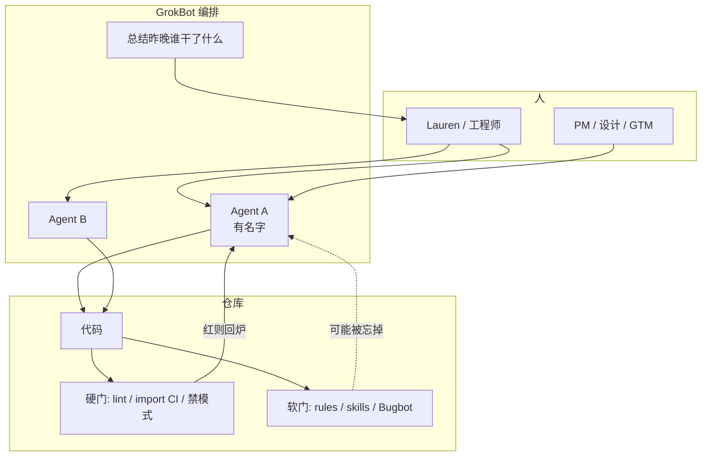
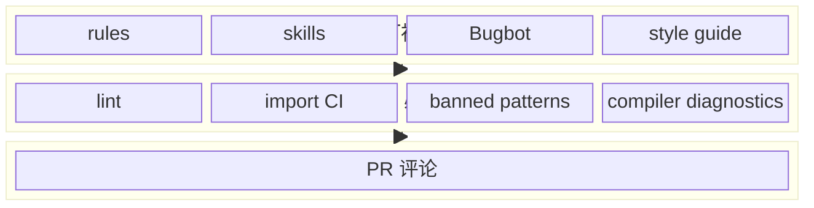
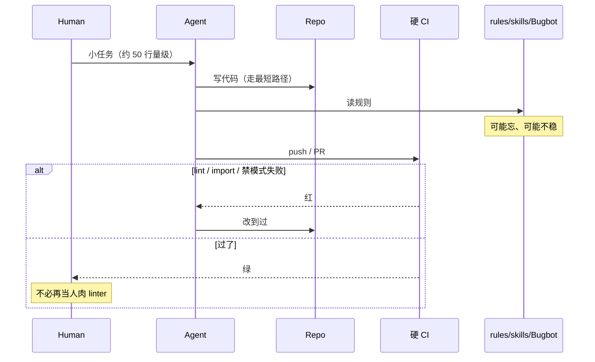
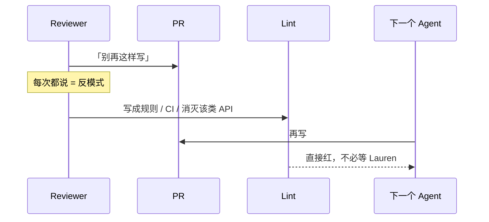
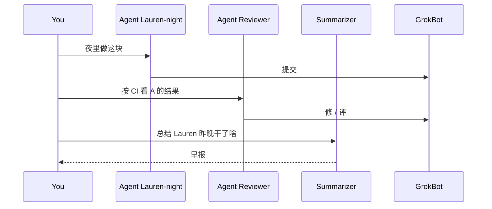

# GrokBot：约束、CI、把 agent 编排成人

- 视频：[x.com/0xCodila/status/2092331579527803215](https://x.com/0xCodila/status/2092331579527803215)（2026-08-25，57:06）
- 原文：[transcript](../../AI/2026/2026-08-25-lauren-tan-grokbot-workshop-transcript.md) · [短摘](../../AI/2026/2026-08-25-lauren-tan-grokbot-workshop.summary.md)
- 主讲：Lauren Tan（Twitter: Potatoe）。当时 Cursor 约五个月；之前 Meta React Compiler，再往前 Netflix TL / EM。
- 片子前约 6 分钟是串进去的 React / `useEffectEvent` / compiler Q&A，她从 06:25 自我介绍开始。ASR 常把 GrokBot 听成 Grocbot / Rockbot / Glockbot。

## 他们在反什么

两头都不讨好：一头是「把思考外包给模型、一周 100 个看不懂的 PR」；另一头是人肉在 review 里当唯一护栏。Lauren 的终点是 **几乎不看代码**——但这是把仓库喂到那个程度之后的结果，不是 vibe coding 的起点。

管 agent 和管人高度同构。GrokBot 让每个 agent 有名字、有账号，像带一小队人。

绿场应用最危险：没有护栏时，你不懂的代码就不该交给 agent 控制。

## 概念分层

| 层 | 东西 | 硬还是软 | 忘了会怎样 |
| --- | --- | --- | --- |
| 形状 | 目录、特性边界、禁止的 import | 硬（静态分析 / import CI） | 编译或 CI 红 |
| 味道 | lint、禁掉的坏模式、compiler diagnostics | 硬 | CI 红 |
| 提醒 | rules、skills、style guide、Bugbot | 软 | agent 仍可能抄近路 |
| 人 | PR 评论 | 最软，且是反模式 | 下次再犯 |

原则：**shortest path is the best path**。Agent 天生抄近路，所以把正确做法做成最短的那条。

另一条：你在 PR 上重复说的那句，就该变成 lint / CI，或者直接消灭这类问题（换 API、拆模块、换语言约束）。

## 架构

### 框图：约束怎么叠

她不反对 soft 层，但 **绝不只靠它**。Rust 之类「编译器很凶」的栈，在这个模型里加分：过编译 ≈ 敢信。

## 时序

### Agent 交 PR，硬门先打

### 人肉评论下沉成门

### 一队 named agent

非工程同事也能走同一条链——前提是硬门已经在。她说 GrokBot 对 GTM / 产品是「Cursor moment」：第一次能舒服地用 agent。

## 她怎么到「不看代码」

1. 先花很多 token 重构：分层、堵 import、把坏模式变成 CI。
2. PR 保持小（她举的是大约 50 行，没有硬顶）。
3. CI「烦」是特性：agent 写 GrokBot 应用时，检查是为这个栈定制的。
4. 承认实验室 token 几乎不限。对外的说法是 ROI：前期贵，若目标是 agent 写大部分代码、团队不膨胀，这账才立得住。

## 时间锚

| 时间 | 点 |
| --- | --- |
| 00:00–06:20 | 串入的 React 问答，可跳 |
| 06:25 | 自我介绍：Potatoe / compiler / Netflix EM |
| 07:24 | 管人和管 agent 同构 |
| 07:42 | 几乎不看代码，是喂仓库喂出来的 |
| 10:23 | constraints + 烦人的 CI |
| 18:16 | shortest path is the best path |
| 20:00 | 只靠 soft，仓库变垃圾 |
| 21:13 | PR 评论 → lint / CI |
| 26:08 | 每个 agent 像一个人 |

## 读原文时注意

前 6 分钟不要写进 GrokBot 架构。专有名词以口型附近的 Cursor / GrokBot / Bugbot 为准。

## 全文原文

按内容分段；每段前是该段起始时间戳。全文保留，不删减。

ASR 原文（Whisper 行级时间戳）仍以 [transcript](../../AI/2026/2026-08-25-lauren-tan-grokbot-workshop-transcript.md) 为准；Tweet/metadata 不收录。

### [00:00] 串入：不要把思考外包

Personally, I think that the best use of AI is really like a pair, like someone you're pair programming with, and not someone that's not a tool to just replace the act of writing code or worse, outsourcing your thinking. And I think there's a tendency like, you know, because AI is so exciting, you want to put AI everywhere and be seen as someone who's very, you know, what do you call it, like on the ball I guess with AI, that you feel this pressure of like, you know, I'm just going to, I got to increase my productivity, I got to ship like 100 PRs this week and barely understand what I'm doing and, you know, vibe code my way to a million ARR or whatever. But I think, you know, one of the things that I've personally seen is that although when I use AI, I save some time, you know, writing the code, I actually find myself spending more time reviewing what the AI did and like correcting it. So, you know, like I've tried the thing that a lot of people say, like, you know, you, instead of prompting an AI to just build the future outright, you sort of get it to build a spec for you first, then you review that spec, and then you do that whole thing. Then it's like, it's such a time consuming process. And if you don't really understand what the AI is doing, then I think you're doing yourself a disservice because it's like the same way that in school you use a calculator or, you know, you have an open book exam. The skill of being a developer is really in like the knowledge of using tools. And I think when you just completely outsource that, you know, thinking, I think that's like really dangerous. But I think, I don't know, I don't know what other people will say to that. But yeah, that's my personal thought. Because I wrote the PR.

### [02:00] 串入：useEffectEvent / compiler

But also it's like, also the same feature that I don't like the most. Should I save the answer for a later question? Let's hear it. Well, so use effect event is like a new API.

We, it's a little bit tough because we don't want people to abuse it. And I think if you start thinking about like, you know, where can I start throwing use effect event across my code base? I think the question you might want to ask first is, do I actually even need an effect here? And then, you know, read the docs on, you might not need an effect. And only in the very rarest of circumstances where you do need an effect, the docs also do a really good job of describing the use cases where you might need a use effect event. And so like the canonical example is where you have, for example, an effect that connects to some web socket, like a chat room, and you might want to trigger some sort of event whenever the user like connects to a chat room, like show a notification. And so use effect event will sort of let you issue that event from the effect without you having to define or declare that dependency in the dependency array. So yeah, it's kind of an advanced API. So don't use it too much. It's the take then. Use effect event is actually one of my favorite features of React 19 as well, because I can imagine a lot of code getting cleaned up. And you're right, like use effect gets abused a lot. So I'm worried use effect event would also get abused a lot. But I'm hoping that people will stop doing that ESLint exception to avoid the dependencies. Yeah, exactly. Definitely use the linter as well, because the new version of the linter will tell you, will give you the appropriate warnings if you're using use effect event incorrectly. So definitely make sure to, if you do have to use use effect event, use the linter. Yeah, and to add to that, I think we talk about this in a doc as well, but you absolutely shouldn't feel pressure to go and like remove all your manual memorization, because the compiler can just optimize your components anyway, even if you've already used manual memorization. So yeah, there's definitely no rush to, you know, delete all of them. And are there plans to deprecate use memo and use callback in the future in favor of Rear compiler? No, I don't think so. Maybe Joe, you want to add more to that? Yeah, so. One thing we've definitely heard a lot is the fact that, you know, the compiler is still a Babel plugin. And we know a lot of the community has moved on to like Rust based tooling, like SWC. So that's definitely like one of the recurring questions we get is like, when is, you know, compiler, the compiler going to work like natively in my SWC build pipeline. And for that, I think that the team we've talked about it a lot. I think our current plan is to, so there's this project at Meta that's called static Hermes. And it's a project to use Hermes, which is our own JavaScript engine, to pre-compile JavaScript into native code. And so the idea being that we can, you know, keep the very flexible development process we have in the compiler, which is written in TypeScript, compile and get the benefits of a natively built binary. But that's still a bit, like maybe I'm not sure, like, how far out that is. But it's something on our radar and something we want to explore. But if that doesn't pan out, then we'll have to think a lot about maybe another attempt at porting the compiler to Rust and then that can work with SWC. But yeah, definitely, though, it's like a question that comes up a lot. Yeah. I suspect there'll be a lot of interesting answers from this, from

### [06:25] 自我介绍：Potatoe / compiler / Netflix EM

this chairs here. Hello, everyone. I am Lauren Tan, I guess not many people know my last name. I am Potato on Twitter, Potato with spelled with an E. And I have been at cursor for about five months. Previously, I was at Meta where I worked on the React team, specifically working on the React compiler, which was a whole lot of fun. I'm still on the core team and contributing to open source here and there. So that's really nice that they still let me do that. And before Meta, I was at Netflix where I was both a tech lead and I transitioned to be an engineering manager for about two years. So I've had a lot of experience going between engineering management and being an individual contributor. And

### [07:20] 管人和管 agent 同构；几乎不看代码

I think something I've noticed, actually, which is quite interesting is that there are so many parallels with management skills and how to manage agents. And that's actually a big part about what I wanted to chat with you and everybody else about today. And yeah, I've gotten to a point where I really don't look at the code anymore. And I say that not just to sell you tokens, but because it took a lot of work to get to that point.

I spent a lot of tokens to get the code base to this point where I no longer have to look at it. But I'm very excited because of the potential where it's not just, this doesn't just benefit me. It benefits everyone contributing to GrockBot. And it also empowers designers and product managers and even GTM people to add features to GrockBot. And I don't have to worry, I don't have to wake up at night in the middle of the night and worry that, oh shit, someone's just merged to perf regression. I think like greenfield applications, especially the brand new applications are the biggest risk, in my opinion, and also the greatest opportunity. Because if you vibe code a project, a prototype, like we did for GrockBot, GrockBot was spun up very, very quickly. And if you haven't heard of GrockBot, it's like a new application we just launched yesterday. It's really cool. Let's you orchestrate your great individual agents that have their own identity and you can kind of orchestrate them. It's super cool. Definitely check it out. But yeah, it was a very greenfield application, like most prototypes are. So it's like vibe coded very quickly. Humans were not reading the code at all. And I had this tweet recently where I said something about organic architecture. Maybe I'll find it.

### [09:08] 绿场 / vibe-coded 应用需要硬约束

But the idea is that when you have a completely vibe coded application, you essentially have no guardrails whatsoever. So your agents, when you give them a task, they will just solve it in whatever method is the most convenient. And over time, you get into this situation where you have a code base that is spiraling out of control, because you don't understand it. Your agents understand it, I guess, in a way, but like they've built something that is, you know, optimized for for shortcuts. And, you know, it will you will suffer, you have a lot of issues with that application. So I think starting your code base with like very strong constraints is very much needed. Because like when you have a code base that you can trust, right, when you have guardrails that actually help you help your agents, right, good code, you can get into the, you know, like into this part of the curve where I where I said, you know, I woke up today and I had like 20 PRs merged by my agents. And that's because I invested a lot of time over 600 PRs. I calculated yesterday when I refactored all of GROCBOT to this new architecture that I've been building. Right, I have a ton of constraints and CI is like, it's actually very annoying to write code in GROCBOT by like agents absorb all of that annoyance. But yeah, I'm happy to talk about what exactly that is. Yeah, I think one question before we get into this part here is just around that element of like what your your CI looks like or maybe some of the constraints and then also like the average PR size. I saw a question about that earlier. Just to get people, you know, kind of a glance. It doesn't have to be like mathematically average, but just, you know, like what generally the size of the PR is, if it's only a couple lines of code or, you know, yeah.

I think it depends. I'm trying to do this in a way where I'm not going to like.

Yeah, you don't have to share the actual number of views. Like an actual average just. This is fine.

That's fine. But like we have, so okay, this is not that interesting, but well, fun fact is that virtualization in GROCBOT and in cursor is actually powered by pretext, which is a sort of new library that someone's built.

That's really interesting. You should you should check it out. But it's not really that important.

I think the average PR size, I actually don't know. I don't know if I want to click on these. I probably can.

But I would say like they can range anywhere from a few hundred lines or 50 lines to like a thousand, depending on what the thing is doing.

So here I'm deleting a bunch of files. So I expect that it's just as like mostly deletion, but it kind of varies.

There's no like, yeah, this is like hard cap or the middle. They're all like 50 line there's no hard cap, but I do encourage my agents to split up their work into multiple PRs. I do that mostly because I like I like the idea of I guess maybe this is much harder to do now as in the world of agents and you have like so many commits.

But I like the idea that, you know, the get history is a very rich source of context and I like the I like each PR to sort of atomically describe what that small piece of thing is doing, which also makes it easier for me to revert changes and like figure out, you know, oh, I shipped a bug and it's this it's here. It's not in this 40,000 line PR where who knows what landed in there.

But I don't have a hard cap on PR size.

### [12:49] CI、禁掉的模式、Dune 架构

Cool. And then yeah, also quick question on like CI. So again, you don't have to go into like the screen share like your CI does.

But just generally, what would you describe what the CI kind of looks like or how strict it is? Yeah. So well, specifically for Rockbot.

So Dune is the is the sort of cheeky code code name for the architecture that we built for Rockbot. The CI looks pretty annoying because there's checks for everything.

So like literally I have. Well, if you've written any reactor, example, you know, you know that one of the biggest foot guns in react is use effect. So in Dune and in Rockbot, we've banned use effect.

So Dune is just the the mental model of what Dune is. You can kind of think of it as like next.js for electron apps and it's designed for agents to write and it's like custom for, you know, our agent powered applications. So the CI checks are very like specific to that.

Like, you know, don't use this effect. It's it's it's bands like CI will fail and yell at you.

We have like some of the more interesting ones that people might raise eyebrows is like I actually banned code comments as well, which is very interesting. But I've noticed that 99% of the time agents just write code comments that kind of describe some historical thing that is actually totally irrelevant to the code. Like it will often say like, you know, oh, Lauren said you should never do this.

And it's now in the code comment like what like why what that was. I didn't say that as like a durable, you know, global rule. I just meant like your this PR sucks and you should change that part.

Agents don't really understand us that well, surprisingly. And or they kind of assume too much and they kind of do things in like very stupid ways. So like, yeah, we just ban everything.

Everything you can imagine like the agents are bad at we ban. So one example that we actually suffer a lot in the agents window is we have, you know, if you've used agents, you've definitely seen performance issues and you know, we're constantly trying to fix them. But it's like a.

So never ending struggle because there's so many pull requests that get merged every any one of them could just regress performance or stability or reliability. You know, the agents window doesn't have this architecture yet. I plan to do bring this learning back there and kind of refactor everything there, but it just regresses super often because there's just one example is like we have very poor isolation between processes.

So like, you know, on Electron, you have a renderer thread that renders your UI, but you also have like a main thread that you can run other code that doesn't need to block the renderer. But we do a poor job of separating those things. And so oftentimes you just accidentally have code that gets pulled into running on the renderer thread.

And then all of a sudden you're competing with the renderer that, you know, that has a very if you want like 60 FPS, you have every frame that gets drawn has to be done in 16 milliseconds. So very, very small, you know, deadline per frame if you want, you know, a very smooth product. And when you start building, bringing in accidentally bringing in, you know, things that are like very computationally heavy or they have a lot of IO, then you just get into like a lot of jank and your FPS really drops.

You start, you know, losing frames. You get long tasks that take more than 16 milliseconds and then you just get this really choppy experience. So all of those patterns that we've learned, basically building Electron apps, we've encoded into this framework and it becomes like a hard failure.

So I literally in GROC about we literally have a directory called Electron main, Electron renderer. And we have import CI, I guess, where we actually check the dependency graph to make sure they're not accidentally importing code from one directory to another. So that's enforced by CI, as well as bug bots, which is our, which cursors like code review tool that runs on CI, you know, in our agents and be it's everywhere.

Like, so I had this thing here where I talk about like, you know, like there are multiple layers, I think, for building a good code base. Obviously, the code base is one where if you have an architecture like this where it's extremely strict, you know, the way to build features is very conventional. That's like the strongest, strongest level of enforcement because agents just love to copy existing patterns.

So one example of this in GROC is like, we have this, these concepts called like a feature and we have entry points and transcript cards, like, you know, the cards that you see in the chat. These are all like, like nouns, I guess, in the framework. And so there's a very conventional way of creating them.

And so like a feature is all in a single directory, as an example. And so all of the code that contributes to that feature lives in one directory. So it's all co-located in one place, makes it super easy.

You know, agents don't have to like grab around and try to figure out like where all the things are. It just looks at the feature and like, oh, OK, I'm working on the onboarding feature in GROCBOT. I'm just going to work in this directory.

And for 80 percent of the work, it's mostly just very encapsulated there. But like, it's like, it's like designed again for, you know, like the dumbest agent, like you don't have to think, right?

### [18:12] Shortest path is the best path

The one of the key principles I have for this framework is like, the shortest path is the best path. So because that plays exactly to how agents love to record, is that they like to take shortcuts, really, you know, to find the quickest way to solve the problem. So why not make that the best way to solve the problem?

So I probably won't get into all the specific details. And this framework is really more of a collection of ideas and principles rather than something that will open source. You can screenshot this, I guess, if you want, and tell your agent to do something like this for you, too.

Yeah, but it's really all about the layers. You know, like the code base is one part with features and directories and, you know, import or blocking import dependencies that shouldn't be imported. But and it all enforces that and static analysis.

So like there are CI checks. We have a lot of links for bad patterns that we observe. Compiler diagnostics.

There's also rules and bug bot, which are, I think, like three, four, five are more soft, right? These two actually make CI read, right?

### [19:27] 软规则不够；PR 评论是反模式

So that, you know, there's a hard constraint where the agent can just write crappy code for rules and skills and bug bot. Your agents can still forget, right? You can still or it may not always consistently apply them.

So I like to layer them, but I don't I don't like to rely on them as the only source of enforcement because it's very, very soft, right? And if you if you only have rules and bug bot and skills and the style guide for code, you will. It's only a matter of time before your code base looks like complete trash.

Sorry to say that, but I definitely recommend investing in things that can be hard enforced, right? And this is why, you know, maybe the choice of tech stack that you use is also very important. Like I think, for example, Rust is sort of making you know, is like getting super popular again because the compiler is so strict, right?

The compiler enforces so many different things, you know, there's a borrow checker that you have to appease and as long as you make sure your agents don't write unsafe code blocks, you can more or less feel somewhat confident that if the code compiles, it probably works and it's good. But usually it gives you that level of trust and confidence that you as a human engineer no longer need to go and check it yourself.

You know, you rely on code and static analysis to actually make that a lot smoother.

And I guess the worst part, the worst place to be in is if you are stuck in code review land where you actually enforce all of the constraints, the invariance in your code base by literally the human person saying, you know, reading the code and like, OK, you should not do this, right? Every time you have to do that, you should consider that as a code like an anti-pattern and you should say, OK, instead of me commenting on the PR, how do I turn this into a hard rule, right?

How do I turn this into a lint rule? How do I turn this into a CI failure? Or how do I even categorically eliminate this problem entirely?

Cool. One question that had a couple of came up a couple of times was just around like token usage. So the question is like, is what you're describing a realistic thing for people who are on, you know, a normal set of token usage they don't have, you know, basically unlimited tokens to work with?

I think that's a really good point. I mean, like, obviously, you know, I work at an AI lab where we have unlimited tokens. So I definitely cannot say that, you know, this is something everyone should do in the exact same way that I did it.

I think it's possible to get to this point without, you know, breaking the bank. But, you know, if you are like an engineering leader or, you know, you have a startup that you lead, I think that may as a question of ROI and it's like, yes, you spend a lot of money on tokens in the upfront stage.

You know, like refactoring your code base is going to take a lot of tokens. Adding all these things is going to take a bunch of tokens. But if we're heading to a world where agents are writing all the code and, you know, you want to be very lean, right?

You don't want to have to hire. You don't want to be, you don't want to become like meta, right? Like, I mean, like in terms of you don't want to become a 10,000 person engineering org because, I mean, that's a cool problem to have.

But also, you know, you have so much overhead. There's like planning, you know, like it's personally, I wouldn't.

It is not super fun. But I think you want to stay very nimble, right? And you want to be like agents are all about allowing you to do things that you couldn't do before.

That's really to me like the value of agents. You know, it's not just storing tokens on every single little thing. But to me, like the thing I couldn't do before is like enforce this level of constraints in a code base by myself, right?

Like I'm just a single person, you know, it would have taken me years to build this framework and do all the refactoring and test everything myself and verify, you know, like run, imagine if it was just me, right? No, in pre-agent era, just like running, you know, it would take me so long.

All right. And my salary is pretty high, right? Like so, you know, the question I think an engineering leader might have is just then, you know, like, what is there's a trade-off of do you hire someone to do this or do you spend the tokens to set up a code base so that even the most naive, right, the dumbest agents can do a good job. And when you actually get to this point, like even agents that are not, you know, fable size do an excellent job of writing code.

And this pays a lot of dividends as well for me personally, where I have been powered, not just myself, but again, like, PMs, designers, engineers who are not familiar with Gropot to just contribute in a way that is sustainable. So, yeah, I think to kind of round it up, I think it's like it's it's there's a if you do your own analysis, I feel like it's pretty positive, it'll be pretty positive that the ROI you get from investing in stuff like this just empowers not just yourself, but your whole team to be so much more productive, right?

Like, imagine if you have an army of engineers like me who are shipping so much improvements and bug fixes every day.

### [24:46] 产品 / GTM：GrokBot 是他们的 Cursor moment

One last question before we wrap up, this one is for the people in product on the call. So let's say we do have an army of engineers for shipping like Lauren. I'm just curious, like, how is the product team or other functions of your company keeping up, given that, like, if you're shipping so quickly, are they using AI more to do their jobs?

Like, as much as you can speak to that, I always say, you know, like, you're not in that role, but just curious about how that works. I think this is where graph bot has been actually exceedingly powerful where so before graph bot, like, you know, obviously cursor only had cursor, like we only had agents window, we had a CLI, we had an IDE. And these are really like power user tools, right?

They're designed for developers, so it's very, very developer centric. You can do knowledge work in them, but it's like the UI is not really optimized for that. So we actually didn't really have, well, I think like a lot of people in like, you know, GTM product, like they might have used cursor to do their work, but it definitely wasn't like a delightful experience with them. I think now with graph bot, it's become graph bot is basically like their cursor moment for people who are not in tech, in my opinion, like, it's like, it's like a very, very accessible way to use agents in a very comfortable, very familiar interface.

It looks like iMessage, and it's very fun, too.

### [26:05] 每个 agent 像一个人

You know, you can give your agent a fun name. You can have, you can kind of do orchestration in a very like natural way where you can sort of, you know, each agent is like a person, and now you're a team of agents like working on one agent per account that you manage, as an example, or if you're a PM, you have, you know, you can have an agent that summarizes all the work that Lauren did last night, and then now you know what I did, right?

So I think our PMs are leveraging of that a lot, and they're shipping code, too. So, you know, oftentimes they will just say, oh, here's a bug. I fix it. Can you look at it?

And then I'll go review it and actually it's just perfect. I'm like, OK, stamp. So I think that shows that, you know, the Dune architecture is holding up, right?

The all the really strict constraints allow people who are not experts in engineering to contribute at a high level. So I feel like I've already seen that payoff a lot where, you know, designers and PMs are just able to to ship features directly.

And that just makes the Glockbot team super fast, right, where we can ship so quickly. And we have a lot planned, so I'm very excited to, you know, to ship more agents to write code. And I'm sure a lot of you have had the same experience as well, is how do you trust it?

You know, especially if you are an engineer that's been writing code for a very long time, you have a lot of opinions and lessons that you've learned about doing good engineering. And when you see agents just, you know, weaning it and, you know, guessing, hallucinating, you know, confidently stating that they found the smoking gun for the hundreds of time, but it's actually not the real problem.

You lose a lot of trust. And when you lose, when you don't have much trust in your agents, I feel like you really can't get the most out of them.

### [27:51] Trust curve

And for me, the parallels like with management. So if I'm an manager, an engineering manager of a team, and I have a bunch of, you know, I have a team of engineers on my team, and I don't trust them, then the mode of operation I'm going to be in is going to be like micro management, right? I'll have to spend a lot of time looking over my report's shoulders and checking that they're doing their work well, you know, that they're not shipping bugs to production.

And so I drew this chart because it's not it's not a very scientific chart, but like this is how I imagine myself and my journey through using agents.

So, you know, like fast forward or back forward or fast back, fast backwards, like a year or so when, you know, nobody was, or not many people were using agents to code. I think you, you know, get into this mode where you are in very heavily in the loop with one or several like a handful of agents.

And you find yourself just constantly figure, you know, try to understand what your agents are doing and you're very, very in loop. You're watching every single output. You are sitting there prompting and you really can't parallelize beyond that because you don't, again, you don't have that trust, right?

You can't go to a hundred agents, like spawn a hundred agents when you don't even trust the output of one agent. So over the past five months, I feel like I've really been able to like ascend this trust curve. And now I'm at the point where I actually have this sounds kind of scary to say this and it makes me sound like a sloth artist, but I promise I'm not.

But I actually have my agents now auto merging PRs for me, which is like a wild thing to say. But like I woke up today and there were like 20 PRs landed and I just reviewed them on main like they were already landed and they were good.

So how did I get to that point? It's basically why I wanted to talk about today. And again, like, yeah, feel free to jump in if you have questions, Colin.

But oh, yeah, of course, I got to show this, this chart where.

No, do not trust someone requested to control my computer.

Probably won't do that. But yeah, so this chart, I think I'm sharing this chart not to kind of like flex, but to kind of show like the journey. Like so you can see like the curve, like it's sort of like inversely matches the contributions I've been able to land at cursor.

So I joined five months ago and five months ago, like, you know, my first month, I was like, not very productive because I was, you know, I was learning the code base, didn't know what the heck was going on. And as I got more confident in my agents, I've really been able to kind of ramp up my productivity. And again, like, yeah, like last month, I shipped a thousand PRs, which is ridiculous.

And then this month, we're only on the 12th. I'm already at like almost 800 PRs landed.

So the velocity is definitely high. And you I'm sure a lot of you will definitely be questioning like how how much of this code is actually good. And I think, yeah, that's definitely fair to question.

But yeah, I think, I think if you set up your agents well, you can definitely get to a very similar level. And so I'm going to talk about how we do that.

So for me, I think I'm curious, like I guess calling your experience as well. But for me, I think the most important skill that you should have in your toolbox when you work with agents is verification.

And by verification, I mean the ability for an agent to actually run the code or take CPU traces or heap snapshots or, you know, open an iOS simulator, whatever, you know, however your application is exposed to your users, it can do the same thing and run it for real and actually test and verify it don't work. Because that's the thing that really closes the loop. It doesn't guarantee your agent writes good code, but it allows them to at least write correct code, which is a big, a really big stop within cursor.

Oops, where let me open this.

There you go.

### [32:31] Agent window 与 verification skill

So for the for cursors agent window. So this is actually an interesting story. But when I joined cursor five months ago, they're actually, well, I was supposed to join a different team I was supposed to join like the cloud agent team.

But then since I have a lot of experience working on React and agents window is a react application, I was I was asked to basically help out with the agent window work.

But there wasn't really a lot of like skills to help me.

So I just found myself like, OK, agents we're going to launch in like a week, right? We have a really tight deadline and there was, you know, I was just sitting there, OK, I'm going to open up the performant, the Chrome Dev tools and just like take a trace, look at it myself and try to make sense of this flame graph. And keep in mind, I was just like in my first week.

So I had no idea what I was looking at. No idea what, you know, I mean, I had some idea. But, you know, the code base was completely fresh to me.

And I realized like my agent had no idea either, you know, like I would take a screenshot of the trial download tray. So I send it to it and it'd be like, yeah, it kind of looks like this, you know, and it would like confidently state like it's this thing. And then I try to fix that and turns out that's not the actual thing.

So this was a very, very slow process. And if you've ever done any like performance work yourself or just even development with an agent where you don't have a verification skill, you are the verifier. You're the bottleneck.

You tell your agent to do something and then it goes off and write some code. Then you open up your local dev build and then you start to say, oh, you know, it doesn't work. Then you got to copy paste screenshots or console errors or whatever.

And then your agent like slowly kind of like, you know, works with that and then tries to understand it and fix the thing.

But then you're constantly just in the loop and being a bottleneck. So there's really no way to parallelize. So the control glass skills, like one of the first skills I built for Cursure and Glass, by the way, is the code name for agents window that we use internally, but it's just Cursure, I guess.

And so this skill is, I guess, the code itself is not super interesting.

Your agent can very easily make one for you, where if you're building an electron app or a web app or even iOS applications, you can teach your agent how to use like the Chrome DevTools protocol or through Apple has some utilities as well for running the simulator and taking traces and programming the control as well. So that's really useful. But one thing I actually want to talk about is the this thing.

Or just to read me. So this skill comes with this very unique feature called or not featured, a unique file called a feature map. And so the story then is like I built this skill.

And so now the agent was able to actually run the agent window and take traces and whatnot. But it had no idea what what the agent's window was. So, you know, like someone say, like, oh, the left side bar is like laggy or something like that.

Or, you know, the right side, the PR tab is not working. And the agent would just be like kind of flailing around. It would spend a lot of time trying to like look up the code.

And, you know, where is this feature? How do I actually get to it on the UI, which made it basically completely useless? You know, like we would I would run the skill locally and, you know, it would spawn a dev build.

But then it just be turning like I just try to click here. It wouldn't know how to get to things. And it was just an awful experience.

So we was putting arrows on my screen. So, yeah, this this feature map has been really useful because it teaches the agent how to get to all of the features that you have. And in Pstack, the plugin that I've made, if you search for Pstack cursor on Google, you'll find it.

But there is a create verification skill in that plugin where it actually helps you set up something like this for yourself, including the feature map. So it will actually explore the code and build up this initial feature map that tells your agent how to get to all of the different features that you have. And this is extremely powerful because now that you have these user reports that come in you can actually map even like a vague report or even a screenshot.

So we have this internally at cursor where we have a Slack channel with lots of people giving us feedback on the agent's window and rock bottom and whatnot. And oftentimes the report is very bad, like very low quality. Like someone will just put very often we get like a screenshot and then someone just says question mark, question mark, question mark.

Like, what is this? And, you know, without this, your agent's like, I have no clue. Right. But with a feature map like this, it has a lot more context and understanding of how to actually navigate how to get to all of the different features.

So, like, you know, example, like, I guess, like the sidebar, like, what is the sidebar? You know, like all the different sub features that are present in it.

Like from the user point of view, here's how to get to it, all the different keyboard shortcuts.

Even like the what do you call it, the DOM elements or, yeah, like the attributes that you use for selecting things through the CDP are all there. So, again, yeah, this is like really, really powerful for agents.

And piece that ships that create verification skill, but also a maintain verification skill, so you can keep this up to date.

### [38:16] P-stack

Cool. Yeah. I was just going to ask how you created that. So do you want to share a little bit more about that process in the context of P stack and maybe just what P stack is for the folks who aren't familiar? Yeah. So P stack is pretty interesting because, well, first of all, the name is kind of goofy.

Like the P the P and P stack is like potato potato snack because I so there is a pretty famous person, Gary Ten, who is the CEO of Y Combinator, and he's come up with this plugin called G stack, Gary stack. And funnily enough, we share the last name. We have no relations, but I thought it'd be funny to kind of poke fun at Gary and make P stack, my version of his plugin, but kind of tailor it to my own set of engineering practices.

But I honestly actually never set out to build P stack. It just started with a bunch of skills, right? Like I started with that control glass skill.

And then I started with another skill like called how, which I also noticed through like observing agents.

So like, you know, in the early days of me, you know, trying to climb this ladder, I was like super in the loop and I was basically nitpicking my agents to an extreme degree. I was like, I would tell it, you know, this feature has stopped working. Here's a bug report.

Like, why isn't it working? And very often, the agent would just like of confidently state, like, oh, it has to be this, right? It has to be this thing.

And I noticed like when I look at the actual tool calls, I noticed it wasn't actually reading the code. That I thought should be affected. And that made me just extremely suspicious.

And at that point, I was like, I'm not going to, I can't trust any, this agent anymore, because it's just, it's just completely hallucinating. And I think, I think it's very easy to just, you know, like build up that distrust and not and kind of feel helpless. Like, you know, you don't know how to help your agents succeed.

But like, again, I think the management analogy is super helpful because like imagine if you were a manager of an engineering team and you had an engineer in your team who was a really good coder, no business context whatsoever. You know, they just, you just hired them and they onboarded, you know, like five seconds ago.

And so how do you actually teach that person to be effective? So how you do that is through a skill, a skill being just, you know, it's just marked down, right? But, you know, it encodes a lot of information, instructions.

A lot of, you can really draw out a lot of intelligence from an agent by, well, some people on Twitter call it, like, you know, pull the agent to a different latent space, which is kind of like a fancy we have just seen. Like since, you know, LLMs are sort of like, they predict the next token, when you give it some high quality tokens to begin with, then, you know, it can kind of pattern match on like a higher space that's, you know, smarter.

So that's like a very interesting model there. But yeah, I built PSAC very, very incrementally. So started with just really observing how agents, you know, all the different failure modes of that agents were having.

And every time I saw that, I just, OK, I'm just going to make that a skill. All right, like stop hallucinating. Actually go and search up, look up the code.

Use a lot of subagents and yeah, stop guessing.

Watch people in the chat.

### [41:36] 怎么维护 skill：evals

So I guess it's two parts. So one is like, how do you maintain these skills? So like the product changes over time.

Obviously there's a lot of people who are shitting against the code base. So how do these skills get maintained? And then second to that is like, how do you know when your verification is good enough like, and, you know, you can trust that the verification loops that you've built are going to, I guess you trust that the outputs when they're done.

Yeah, maybe I'll talk about, I think there's some art really that I'll maybe I'll start with this one first. So like, how do I maintain these skills? So if you're not familiar with this concept and eval is essentially like a way to, the mental model I had is like, it's like a unit test for an agent and you can actually make your own evals.

You don't need like a special framework for them. You can build one depending on like, you know, how scientific and how rigorous you want to be. My screen is red.

Yeah, there's a little button. Sorry. Disabling the drawing or something.

I can't see my screen. Yeah, sorry. If you guys could not draw on the screen, I agree.

But there's a little button in the troll. Yeah, the little drop down. I clear.

Yeah. Okay. Yeah, you got it.

Perfect. Um, yeah. So evals are a way to unit test your skills basically.

And actually in P stack, we ship under potato mode. There's a playbook. If you search for it called eval playbook.

Um, and it's, uh, uh, it's like not, it's actually pretty, pretty rigorous the way it's done. But, um, essentially what I do is I spawn a lot of different sub agents. I have like my main coordinator agent, uh, come up with a rubric for, uh, what I want the skill to do.

Um, and then it spawns all these sub agents and it, it creates individual directories for them, uh, which are cleverly named to not let the sub agent know that it's being evaluated because, uh, agents can actually tell.

And when they do, they change their behavior. Uh, but it does a bunch of stuff like that to, um, essentially, yeah, like test whether or not the skill I'm making or changing is actually doing what I think it does. Um, and one of the really nice things about cursor is that we are, we support so many different models.

So you can actually eval your skill across all sorts of different models. Um, and, you know, get a sense of how well it performs across that different matrix, um, especially for the models that you use. Uh, so I do this a lot.

Every time I modify a skill, I will run one of these, uh, like the eval playbook, uh, and make sure that, you know, it's actually leading to a result I want.

Uh, but I will say like maintaining skills is actually pretty hard. Uh, it requires, I think a lot of taste and observation. So you kind of need to be very good at being a backseat driver.

You know what I mean? Like if you do pair, if you've ever done pair programming, for example, uh, and you watch a coworker code and you just like, you could probably do this better. You know, you could do it, you know, like, why did you not do this?

Right? You, you ask a lot of questions to your coworker. And it's kind of a similar thing here.

You like, you don't want to just be a passive observer agent. You want to be very in the driver seat in the initial stages when you're building up your own set of skills. Uh, you know, obviously you can use something like PSAC, but if you're building your own set of skills, it's very, I think, you know, opening up the, all the tool calls and like reading the code and reading all the agent behavior and their thinking blocks is a really great way to see where they, they fail, right?

Like what, what, you know, where are they being done? And then you can go and build a skill for that. And then with verification, how you trust it is, it's, I think it's also a very similar iteration loop, uh, where, you know, like I actually did the same process for verifying the verification skill where I actually get, um, so one thing that's interesting about evals is that you can sort of hill climb them, meaning that, uh, your eval can produce a score, right?

A score that you can get your coordinator to produce, uh, but also you can have a judge agent of a different model to, uh, kind of cross reference and make sure that the first model is not being biased, right? The model that's judging all of the sub agents that are running the thing, uh, but you can also like hill climb. So meaning that you can, you can use like slash loop in cursor and you can say, okay, keep looping on this eval, right?

Until everything is 10 out of 10, as an example. Uh, and I did the same, the basically the same approach with the control skill. And so I kind of, it was very, it was very hands off actually.

Uh, so, you know, I, uh, I kind of built, I built that skill that way, like the CLI in that skill. Um, and overtime is gone really good. Uh, but yeah, it was definitely not super smooth at the beginning and required a lot of iteration.

And I think there's an analogy here for me, which is, um, while I make this analogy later in a different slide on my drawing here, uh, but I think of it like, uh, you know, as a, as a engineer now, you're sort of more like, uh, like meaning manager, or the analogy I like is like, you're like a chef in a restaurant, uh, you're the head chef, uh, you're not cooking all the food yourself anymore. You have a team of cooks, right? You have a line cooks, you have a sous chef, you have, you know, all these different stations.

Um, and it's your job to really design the environment. You know, you, you're in charge of setting up the kitchen. You're in charge of, you know, like giving tasks to different people.

So, um, yeah, it's a very interesting way of working.

Uh, but yeah, that's, that's how I basically built, uh, these verification skills. Yeah. Just, just one ball there.

I'm like, I had to go, try to go one layer deeper. So are you, let's say we wanted to build, um, uh, an eval or a skill for, for something. And we wanted to kind of get better on its own, which is, is what I think you're suggesting.

Uh, are you doing that in like a work tree, kind of isolated with like the sub agents and then the reviewer agents and, and all that. Is it happening like in some type of cloud hosted environment?

### [47:44] 实践步骤：先本地观察

Like what's the more, the practical steps? If I wanted to go do this, uh, and like set up a verification system for something, what would I, what would I do or what would I start? Um, I think that, uh, the best place to start is local because you can observe.

You can definitely observe what your agents are doing. So, uh, if you're building a verification skill for yourself, uh, I would definitely start local and just have your agent bring up the application, whether it's like a CLI or, uh, desktop app or whatever. And so you can actually observe, right?

You can see how the agent is interacting with the, the application, you can see it, you know, how it calls like the different APIs that allow it to interact with the, uh, the application. Um, but, uh, for me personally, uh, I have basically been kind of all in mostly all in non-cloud agents because they're extremely powerful. Uh, and the really powerful thing about cursor is the, the cloud agents actually, where if you spend a little bit of time setting up the environment, these control skills, these verification skills pay a huge amount of dividend because it's not just something that makes you as a single engineer better, it actually levels up your whole team.

Uh, and even your whole company, because, uh, you can actually start thinking about cloud agents, you can start thinking about automations that automatically do things like, uh, I'll, I get, I kind of talk about this a bit later, but I'll just kind of get into it, uh, where, where, you know, for example, like I talk a lot about this agent we have called Benny, right, who, who, uh, you know, takes all of the bug reports that we get and it automatically goes off in the cloud, opens up a cloud, uh, it's, you know, it's desktop.

It runs cursor in its own computer and it uses the same control skills to interact with the application and try to reproduce the bug, uh, or the user report, right, and this is so, so powerful because at once I can immediately, I get so much information from this automatically. Like here in this example, you can see that, uh, the Benny actually reproduced the bug, uh, but it's already fixed on main. So it actually confirms that we fixed this problem already and all I need to do is just release another build of, of cursor, uh, so there's like huge information there that I didn't have to go off and sit with an agent, you know, and spend an hour trying to feel like, is this fixed, is this not fixed?

So you, you, you gain back so much time, uh, but you know, everybody on my team benefits from this, everybody in the company benefits from this, uh, so definitely think that, uh, you know, keeping these, uh, using cloud agents is super powerful, uh, but yeah, it's like a journey. You have to trust it first, right, before you, you get to this point and that's, it goes back to what I was saying here where, you know, it's very hard, it's almost impossible and I would definitely encourage you not to try to jump from, you know, like, if you're still in this zone, you don't want to jump to like, I'm going to spawn a hundred, a thousand or thousands of cloud agents right now because you're just going to waste a lot of tokens, um, and it's going to be extremely expensive.

Yeah. So just to kind of recap so far, basically, the, if we wanted to go on the journey that you've kind of gone on, it would be to start with verification, um, building some, some skills and some, some ways of determining that the agents are producing at least like correct code, whether, like you said, whether it's good code or not is maybe a separate question, but like it's, it's technically solving the problem by looking at, you know, stack traces, looking at, you know, the actual behavior in the app and so on.

Um, and then once we trust it locally, then we can start to think about scaling into the cloud and running more agents that are picking up signals, I guess on their own, right. So whether it's like a bug report that comes in or something, they can go and pick it up and solve the problem and give us back a PR. I don't know, maybe the last step is like auto-merging the PRs, which is where you're at, maybe not where everyone's at, and then reviewing the one made, but is that, is that about right?

Yeah, exactly. I think, yeah, that's why I drew this, this, this curve, right, because that, this basically describes my journey of, you know, when I started, barely could use a couple of agents and I was just observing every single thing.

### [51:40] 信任、fork P-stack、收尾

I think there's really no shortcut from going from here to there, because this is really about your personal level of trust in agents, right. Obviously, you know, as an engineer, you don't want to just slot code into production. So how do you actually build out that trust takes a lot of, I guess, taste and judgment, but, you know, like, I think plugins like P-Stack definitely kind of help you get up to speed much quicker, and so I guess it's like, if you trust me and you trust P-Stack, then in by extension, you can maybe trust your agents, but if you don't trust me, and I definitely would not encourage people to blindly trust me, you know, if you build up your own set of skills that you can obviously, you know, take a look at P-Stack and kind of fork it, make it your own, improve the skills, definitely encourage that, but for me, it's really all about, it just keeps coming back to trust.

You know, every one of us here in this chat have a different standard for engineering, and there are different things that are important for us in our code base, and when you are able to encode all of that into skills and you can verify that your agent is actually doing them, that allows you to really kind of ascend this curve and, you know, start automating things. Yeah, I think there's a third part to this, which I haven't talked about yet, which is kind of an interesting one, which is like refactoring and rewriting, like one of the, I guess, most controversial, one of the most controversial topics in the industry, I think, is like, should you rewrite your app or not, because I think engineers are very prone to this where, especially when you join a company, you come in and you see like the code base and you're like, man, this is shit.

Like, who wrote this code? You know, it's terrible. I want to rewrite the whole thing.

There is a very common inclination, and I think a lot of, you know, before agents, and I guess arguably even now, people will definitely discourage you from rewriting stuff, but I'm actually here to make a case for why you might want to consider it, because I think it really depends. You know, Brownfield applications, I think, are actually in a pretty good spot, especially if they're set up well already, and like recently I've been talking to some people, but, you know, I was just observing, I just noticed this parallel, which is that a lot of big tech company problems are now everybody's problems, and the big tech company problem, you know, like when I was working at Meta, like we had this giant monoripo we had like, I don't know, 10,000s of engineers just, you know, like banging on their keyboards and shipping code, and a lot of really great engineers at Meta, but I'll say like, you know, you'll be surprised that the code quality is actually not that good, and so I often joke that like, you know, before AI sloth, we had human sloth, and so, you know, I think a lot of big tech info, like what Meta has, or Google, you know, really big tech companies, are actually designed for that, where you're sort of like, you're catering to the, you know, like, this sounds so bad to say, but like, the least capable engineer on your team, right, you build frameworks, you build conventions, you build guardrails, you know, you restrict credentials so that, you know, your intern doesn't wipe your production database, there's, you know, if you have that level of info already, I think your agents can actually already do a very solid job, right, because they have, the guardrails are already in place for agents to not cause havoc, or not cause too much havoc in your codebase, and you can always add more, you know, guardrails, but I think, yeah, it's definitely like a trade-off for sure, you know, like, nothing that's like free for sure, and tokens are pretty expensive, but oh, actually, I don't know how many of you have seen this, but we actually announced GROC 4.6 today, so very exciting, finally out, so yeah, GROC 4.6 would be like a great, it was very, very smart, it's really good on the benchmarks, and it's the same, the tokens, well, I hopefully I'm not saying this incorrectly, but I believe the cost per token is the same as 4.5, so you're actually getting more intelligence for the same cost, I think this is an area that Cursor tries to, Cursor and SpaceX AI, try to really optimize for, like that Pareto frontier of, you know, cost versus intelligence, you know, we don't necessarily want to build the biggest model ever because that is extremely expensive to run, it's really about like, how do you find that sweet spot, right, you don't need a giant model, but it's just super smart, right, and it's not very expensive for inference, but yeah, that's awesome, we are timed, so I guess, Lauren, if folks want to support you, maybe go try out GROC 4.6 and, you know, get to provide some feedback, but yeah, this was awesome, really appreciate you taking the time, thanks everyone for all the messages in the chat, lots of good questions, I know we didn't get through everything, but as I kind of said at the top, way more questions than we could get through, but yeah, really, really thanks, thanks for joining, thanks everyone for joining, and hopefully you enjoyed the session. Yep, I see, thanks for having me, and if you have any more questions, just DM me on Twitter, I'll open them up, I guess. You're gonna get a lot of DMs. Yeah, I'll open the updates, so yeah, DM me, maybe I'll do like a Twitter space at some point, that's all for more questions, but really appreciate everyone for showing up, you know, taking an hour out of your day. Yeah, all right, thanks, I'll see you the next one.
