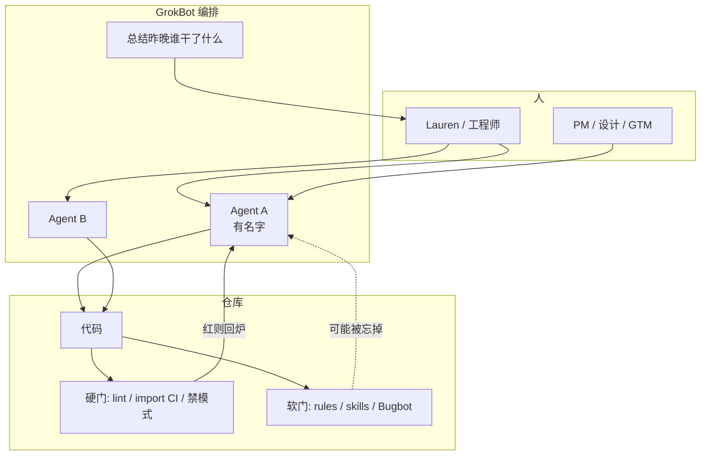
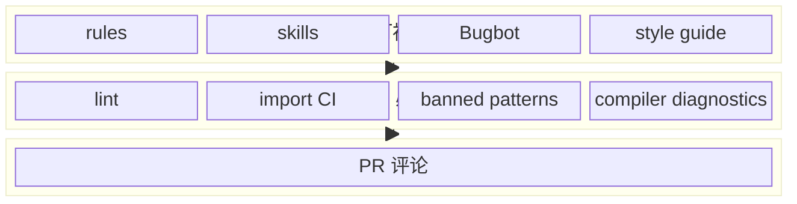
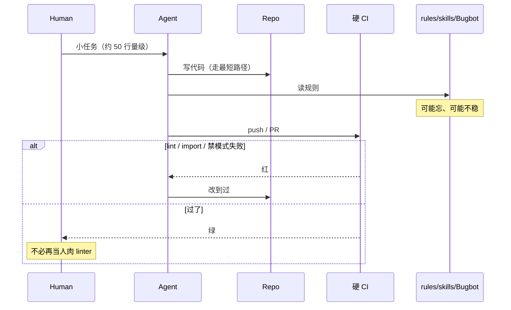
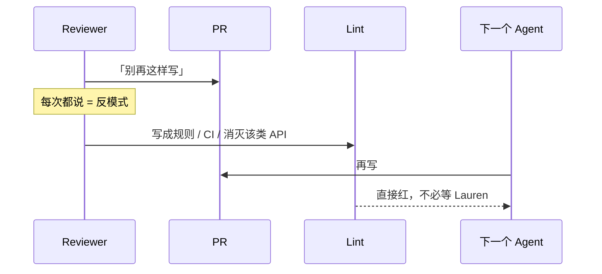
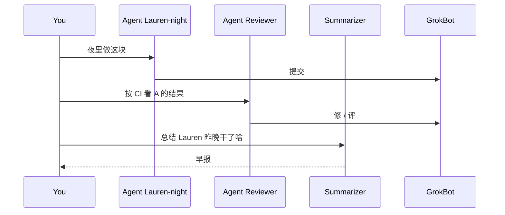

# GrokBot：约束、CI、把 agent 编排成人

- 视频：[x.com/0xCodila/status/2092331579527803215](https://x.com/0xCodila/status/2092331579527803215)（2026-08-25，57:06）
- 原文：[transcript](../../AI/2026/2026-08-25-lauren-tan-grokbot-workshop-transcript.md) · [短摘](../../AI/2026/2026-08-25-lauren-tan-grokbot-workshop.summary.md)
- 主讲：Lauren Tan（Twitter: Potatoe）。当时 Cursor 约五个月；之前 Meta React Compiler，再往前 Netflix TL / EM。
- 片子前约 6 分钟是串进去的 React / `useEffectEvent` / compiler Q&A，她从 06:25 自我介绍开始。ASR 常把 GrokBot 听成 Grocbot / Rockbot / Glockbot。

## 他们在反什么

两头都不讨好：一头是「把思考外包给模型、一周 100 个看不懂的 PR」；另一头是人肉在 review 里当唯一护栏。Lauren 的终点是 **几乎不看代码**——但这是把仓库喂到那个程度之后的结果，不是 vibe coding 的起点。

管 agent 和管人高度同构。GrokBot 让每个 agent 有名字、有账号，像带一小队人。

绿场应用最危险：没有护栏时，你不懂的代码就不该交给 agent 控制。

## 概念分层

| 层 | 东西 | 硬还是软 | 忘了会怎样 |
| --- | --- | --- | --- |
| 形状 | 目录、特性边界、禁止的 import | 硬（静态分析 / import CI） | 编译或 CI 红 |
| 味道 | lint、禁掉的坏模式、compiler diagnostics | 硬 | CI 红 |
| 提醒 | rules、skills、style guide、Bugbot | 软 | agent 仍可能抄近路 |
| 人 | PR 评论 | 最软，且是反模式 | 下次再犯 |

原则：**shortest path is the best path**。Agent 天生抄近路，所以把正确做法做成最短的那条。

另一条：你在 PR 上重复说的那句，就该变成 lint / CI，或者直接消灭这类问题（换 API、拆模块、换语言约束）。

## 架构

### 框图：约束怎么叠

她不反对 soft 层，但 **绝不只靠它**。Rust 之类「编译器很凶」的栈，在这个模型里加分：过编译 ≈ 敢信。

## 时序

### Agent 交 PR，硬门先打

### 人肉评论下沉成门

### 一队 named agent

非工程同事也能走同一条链——前提是硬门已经在。她说 GrokBot 对 GTM / 产品是「Cursor moment」：第一次能舒服地用 agent。

## 她怎么到「不看代码」

1. 先花很多 token 重构：分层、堵 import、把坏模式变成 CI。
2. PR 保持小（她举的是大约 50 行，没有硬顶）。
3. CI「烦」是特性：agent 写 GrokBot 应用时，检查是为这个栈定制的。
4. 承认实验室 token 几乎不限。对外的说法是 ROI：前期贵，若目标是 agent 写大部分代码、团队不膨胀，这账才立得住。

## 时间锚

| 时间 | 点 |
| --- | --- |
| 00:00–06:20 | 串入的 React 问答，可跳 |
| 06:25 | 自我介绍：Potatoe / compiler / Netflix EM |
| 07:24 | 管人和管 agent 同构 |
| 07:42 | 几乎不看代码，是喂仓库喂出来的 |
| 10:23 | constraints + 烦人的 CI |
| 18:16 | shortest path is the best path |
| 20:00 | 只靠 soft，仓库变垃圾 |
| 21:13 | PR 评论 → lint / CI |
| 26:08 | 每个 agent 像一个人 |

## 读原文时注意

前 6 分钟不要写进 GrokBot 架构。专有名词以口型附近的 Cursor / GrokBot / Bugbot 为准。
